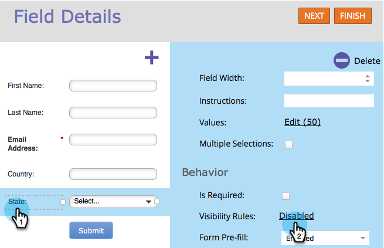
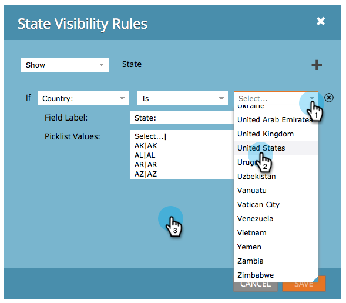
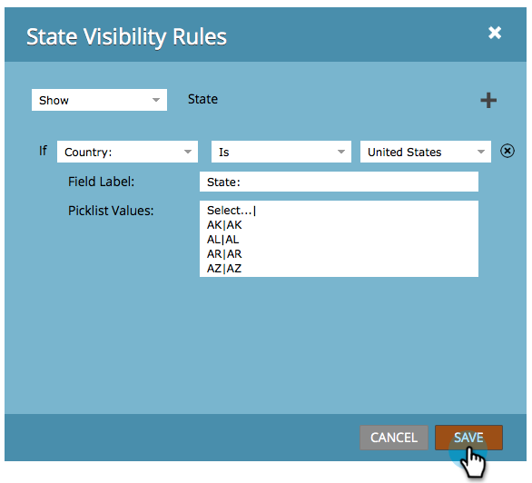

# Dynamically Toggle Visibility of a Form Field {#dynamically-toggle-visibility-of-a-form-field}

>[!PREREQUISITES]
>
>* [Add a Country Picklist to your Form](/help/marketo/product-docs/demand-generation/forms/form-actions/add-a-country-picklist-to-your-form.md)

One really cool feature of Marketo forms is that you can dynamically hide/show form fields or [fieldsets](/help/marketo/product-docs/demand-generation/forms/form-fields/add-a-fieldset-to-a-form.md).

>[!NOTE]
>
>**Example**
>
>In this example, let's hide the **State** field unless **Country** is selected as "United States."

1. Go to **[!UICONTROL Marketing Activities]**.

   

1. Select your form and click **[!UICONTROL Edit Form]**.

   

1. Select the field you want to hide/show dynamically and click the link for **[!UICONTROL Visibility Rules]**.

   

1. Find and select the field you want to build a condition around.

   

1. Select the operator.

   >[!TIP]
   >
   >This is cool because you can choose fuzzy matches like "[!UICONTROL starts with]."

   

1. Select the value(s) to look for, then click outside of the drop-down.

   

   >[!TIP]
   >
   >You can select multiple values by clicking them while the drop-down is open. For example, you can select United States and Canada.

   >[!NOTE]
   >
   >We previously converted Country to a pick-list field type and [added all countries as values](/help/marketo/product-docs/demand-generation/forms/form-actions/add-a-country-picklist-to-your-form.md).

1. Click **[!UICONTROL Save]**.

   

And that's it! Now when people fill out this form and select United States for Country, the State field will dynamically appear with the choices specified.

>[!IMPORTANT]
>
>Form field behavior will work seamlessly when field values are set/updated through custom script using [API functions](https://developers.marketo.com/javascript-api/forms/){target="_blank"} in Forms 2.0.
>
>Conditional fields may not work as expected if field values are modified by external scripts other than the Forms 2.0 JavaScript API.
