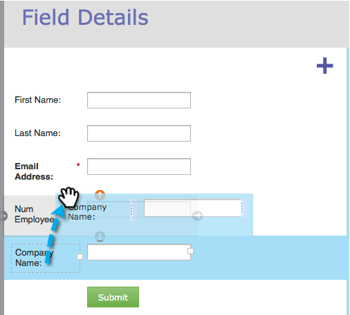

# Reorder Fields in a Form {#reorder-fields-in-a-form}

It's easy to re-order fields on a Marketo form. Here's how.

1. Go to **Marketing Activities**.

   

1. Select your form and click **Edit Form**.

   

1. Drag and drop fields into the order you want.

   

>[!TIP]
>
>You can also drag and drop the fields next to each other. This allows you make columns!

Great job! You are rockin' this thing.
