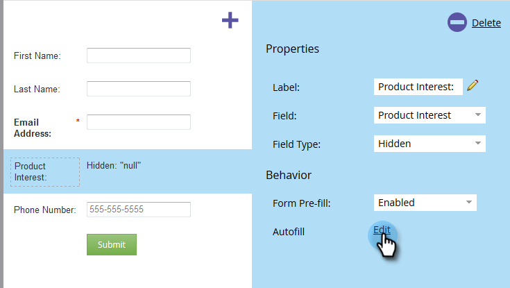
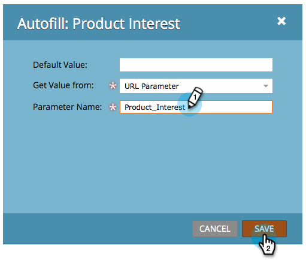
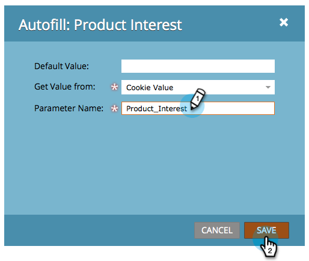
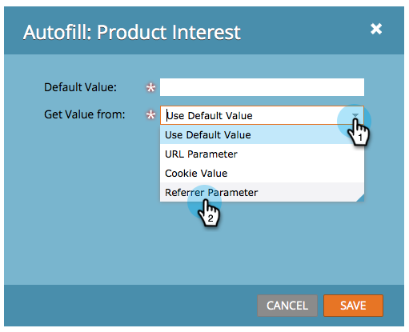

# Set a Hidden Form Field Value {#set-a-hidden-form-field-value}

Hidden fields are usually populated dynamically. They are not shown to the person filling out the form. Here's how to set the value.

>[!PREREQUISITES]
>
>[Set a Form Field as Hidden](/help/marketo/product-docs/demand-generation/forms/form-fields/set-a-form-field-as-hidden.md)

## Select the Field {#select-the-field}

1. In your form, select the hidden field and click **[!UICONTROL Edit]** for **[!UICONTROL Autofill]**.

   

## Use Default Value {#use-default-value}

By selecting Use **[!UICONTROL Default Value]** you can hard-code a specific value to always be used when this form is submitted. Enter the **[!UICONTROL Default Value]** and click **[!UICONTROL Save]**.

## URL Parameter {#url-parameter}

If you want to capture URL Parameters (Query Strings) from the page the person is on when filling out the form, you can use **[!UICONTROL URL Parameters]** to populate your hidden field.

>[!NOTE]
>
>Parameters are kinda techie, aren't they? Once you get them though, they are powerful. This [Wikipedia page on Query Strings](https://en.wikipedia.org/wiki/Query_string) is somewhat helpful.

1. Select **[!UICONTROL URL Parameter]** for **[!UICONTROL Get Value Type]**.

   

1. Enter the **[!UICONTROL Parameter Name]** and click **[!UICONTROL Save]**.

   

>[!TIP]
>
>You can enter a **[!UICONTROL Default Value]** in case the URL parameter is not found.

## Cookie Value {#cookie-value}

If you're storing data in cookies, you can use **[!UICONTROL Cookie Value]** to pick up data when the form is submitted.

1. Select **[!UICONTROL Cookie Value]** for **[!UICONTROL Get Value From]**.

   

1. Enter the cookie **[!UICONTROL Parameter Name]** you want and click **[!UICONTROL Save]**.

   

   >[!TIP]
   >
   >You can enter a **[!UICONTROL Default Value]** in case the parameter/cookie is not found.

## Referrer Parameter {#referrer-parameter}

If you want to capture data from the page the visitor came from before filling out the form, you can use **[!UICONTROL Referrer Parameter]**.

1. Set **[!UICONTROL Get Value From]** to **[!UICONTROL Referrer Parameter]**.

   

1. Enter the **[!UICONTROL Parameter Name]** which you want to snatch from the referrer URL and click **[!UICONTROL Save]**.

   

   >[!TIP]
   >
   >You can enter a **[!UICONTROL Default Value]** in case the referrer parameter is not found.

1. Click **[!UICONTROL Finish]**.

   

1. Click **[!UICONTROL Approve and Close]**.

   
