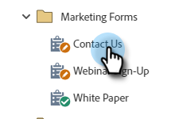
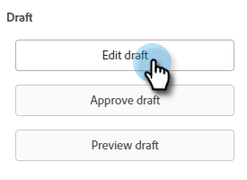
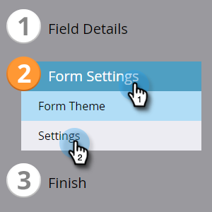
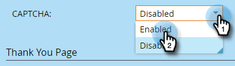
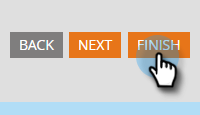
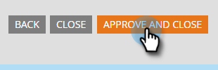

# Enable CAPTCHA in Marketo Forms {#enable-captcha-in-marketo-forms}

You can enable/disable [!UICONTROL CAPTCHA] on a per-form basis.

1. Find and select your desired form.

   

1. Click **[!UICONTROL Edit Draft]** (if the form is already approved, click [!UICONTROL Create Draft]).

   

1. Click **[!UICONTROL Form Settings]**, then **[!UICONTROL Settings]**.

   

1. Open the **[!UICONTROL CAPTCHA]** drop-down and select **[!UICONTROL Enabled]**.

   

1. Click **[!UICONTROL Finish]**.

   

1. Click **[!UICONTROL Approve and Close]**.

   

It may take a few minutes for changes to this list to propagate from Google.

>[!NOTE]
>
>Standardized text, including links to Google's Privacy Policy and Terms of Service, will be added to your CAPTCHA-enabled form(s).

>[!MORELIKETHIS]
>
>[Setting up reCAPTCHA v3](/help/marketo/product-docs/demand-generation/forms/using-captcha/setting-up-recaptcha-v3.md)
