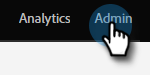
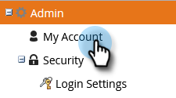
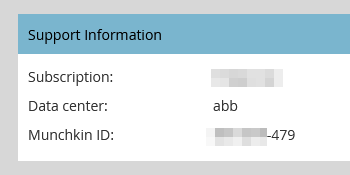
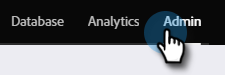
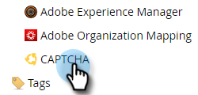
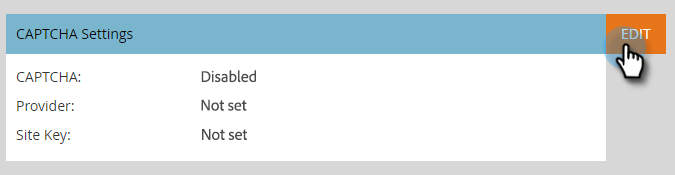
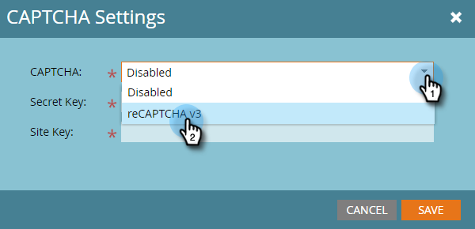
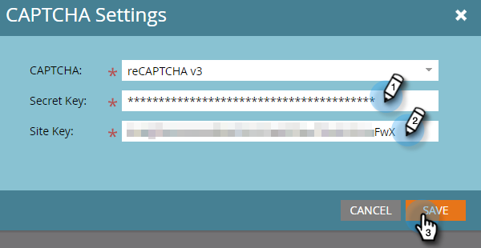

# Setting up [!UICONTROL reCAPTCHA v3] {#setting-up-recaptcha-v3}

ReCAPTCHA v3 is a frictionless experience that scores form submissions based on how suspicious they are without using text, image, or button challenges. [Learn more](https://developers.google.com/search/blog/2018/10/introducing-recaptcha-v3-new-way-to){target="_blank"}.

## Retrieve Your [!UICONTROL Data Center] and [!UICONTROL Munchkin ID] {#retrieve-your-data-center-and-munchkin-id}

For Step 6 in the Initial [!UICONTROL reCAPTCHA v3] setup section below, you'll need your Marketo Engage subscription's [!UICONTROL Data Center] and [!UICONTROL Munchkin ID]. Here's how to find them.

1. In Marketo, click **[!UICONTROL Admin]**.

   

1. Click **[!UICONTROL My Account]**.

   

1. Scroll down to [!UICONTROL Support Information].

   

## Initial [!UICONTROL reCAPTCHA v3] setup {#initial-recaptcha-v3-setup}

The following steps are performed outside of Marketo.

1. Go to [https://www.google.com/recaptcha/about/](https://www.google.com/recaptcha/about/){target="_blank"} and click on v3 Admin Console.

1. Sign in/sign up with a Google account.

1. Click the [!UICONTROL Create] button (+ sign) to create a new key.

1. Create a label to identify the key is to be used for Marketo Engage.

1. Choose type **[!UICONTROL reCAPTCHA v3]**. Marketo Engage does not currently support reCAPTCHA v2.

1. Add each domain the Marketo Engage subscription uses. Domains not set here will return errors on forms where reCAPTCHA is enabled. Remember to replace the words 'datacenter' and 'munchkinID' with the [data in your subscription](#retrieve-your-data-center-and-munchkin-id).

   * app-datacenter.marketo.com
   * munchkinID.mktoweb.com
   * any landing page domain and alias configured in the subscription

   >[!NOTE]
   >
   >As an example, if your account's [!UICONTROL Data Center] is "sjst," the domain you'd allowlist would be `app-sjst.marketo.com`. If your [!UICONTROL Munchkin ID] is 123-ABC-789, the domain you'd allowlist would be `123-ABC-789.mktoweb.com`.

1. Set an owner and additional email address that should receive any alerts about this service.

1. Accept the reCAPTCHA Terms of Service.

1. Click **[!UICONTROL Submit]**.

   >[!NOTE]
   >
   >Keep the site key and secret key handy for the Marketo Engage configuration.

## Setting up CAPTCHA in Marketo Engage {#setting-up-captcha-in-marketo-engage}

>[!IMPORTANT]
>
>After you follow these steps and [enable CAPTCHA in your first Marketo form](/help/marketo/product-docs/demand-generation/forms/using-captcha/enable-captcha-in-marketo-forms.md){target="_blank"}, be sure to test the form right away as any sort of misconfiguration in the reCAPTCHA setup can break the form.

1. In Marketo, click **[!UICONTROL Admin]**.

   

1. Select **[!UICONTROL CAPTCHA]** in the tree.

   

1. Click **[!UICONTROL Edit]** on [!UICONTROL CAPTCHA] settings.

   

1. Click the [!UICONTROL CAPTCHA] drop-down and choose [!UICONTROL reCAPTCHA v3].

   

1. Insert the **[!UICONTROL Secret Key]** and **[!UICONTROL Site Key]**. Click **[!UICONTROL Save]** when done.

   

>[!MORELIKETHIS]
>
>[Enable CAPTCHA in Marketo Forms](/help/marketo/product-docs/demand-generation/forms/using-captcha/enable-captcha-in-marketo-forms.md)
