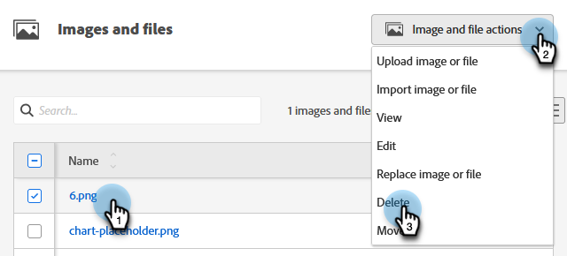
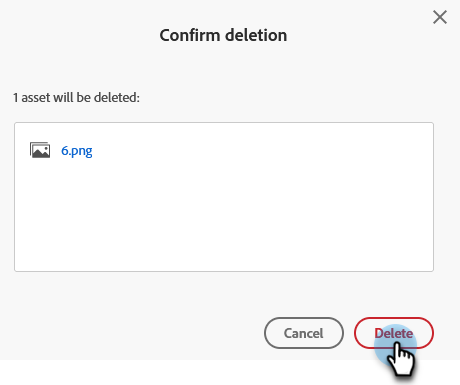

# Delete an Uploaded Image or File {#delete-an-uploaded-image-or-file}

Deleting images or files is quick and easy.

>[!CAUTION]
>
>Once deleted, images/files are completely removed from Marketo Engage and cannot be recovered. 

1. Go to the **[!UICONTROL Design Studio]**.

   

1. Select **[!UICONTROL Images and Files]** 

   

1. Find and select the desired image/file. Click the **[!UICONTROL Image and file actions]** drop-down and select **[!UICONTROL Delete]**.

   

1. Verify you've selected the correct file and click **[!UICONTROL Delete]**.

   

   >[!NOTE]
   >
   >Assets won't delete if they're currently in use.

>[!MORELIKETHIS]
>
>* [Replace an Uploaded Image or File](/help/marketo/product-docs/demand-generation/images-and-files/replace-an-uploaded-image-or-file.md){target="_blank"}
>* [Search Uploaded Images and Files](/help/marketo/product-docs/demand-generation/images-and-files/search-uploaded-images-and-files.md){target="_blank"}
>* [Find the URL of an Uploaded Image or File](/help/marketo/product-docs/demand-generation/images-and-files/find-the-url-of-an-uploaded-image-or-file.md){target="_blank"}
