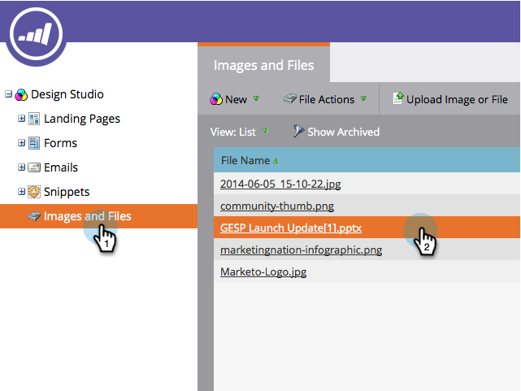
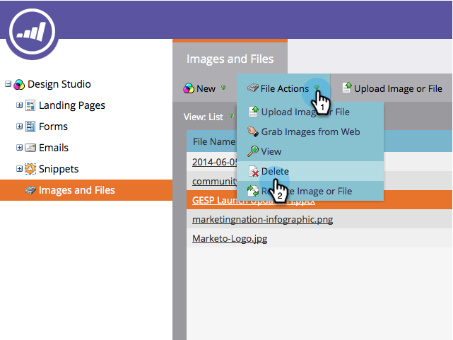
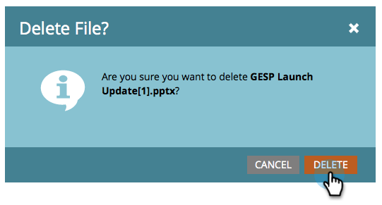

# Delete an Uploaded Image or File {#delete-an-uploaded-image-or-file}

1. Go to the **Design** **Studio**.

   

1. Select **Images and Files** in the left menu, then click next to the name of the file you want to delete.

   

1. Click the **File Actions** drop-down and select **Delete**.

   

1. Verify you've selected the correct file and click **Delete**.

   

   >[!CAUTION]
   >
   >Deleted images and files are completely removed from Marketo and cannot be recovered.  They will no longer be displayed on any landing pages or emails where they were in use.

1. You'll be returned to the **Images** and **Files** page, where you'll see that your file has been deleted.

   

Nicely done!

>[!MORELIKETHIS]
>
>* [Replace an Uploaded Image or File](/help/marketo/product-docs/demand-generation/images-and-files/replace-an-uploaded-image-or-file.md)
>* [Search Uploaded Images and Files](/help/marketo/product-docs/demand-generation/images-and-files/search-uploaded-images-and-files.md)
>* [Find the URL of an Uploaded Image or File](/help/marketo/product-docs/demand-generation/images-and-files/find-the-url-of-an-uploaded-image-or-file.md)
