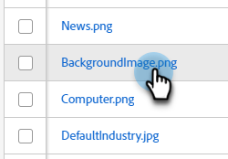
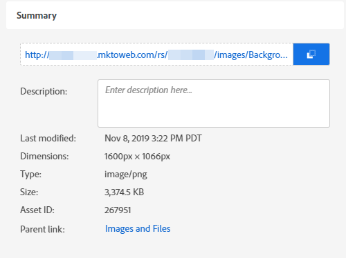

# Find the URL of an Uploaded Image or File {#find-the-url-of-an-uploaded-image-or-file}

Looking for the web address (URL) of an image or file you uploaded?

1. Go to the **[!UICONTROL Design Studio]**.

   

1. Click **[!UICONTROL Images and Files]**.

   

1. Select the desired asset.

   

1. The **[!UICONTROL URL]** is displayed on the details page.

   

>[!MORELIKETHIS]
>
>[Replace an Uploaded Image or File](/help/marketo/product-docs/demand-generation/images-and-files/replace-an-uploaded-image-or-file.md){target="_blank"}
