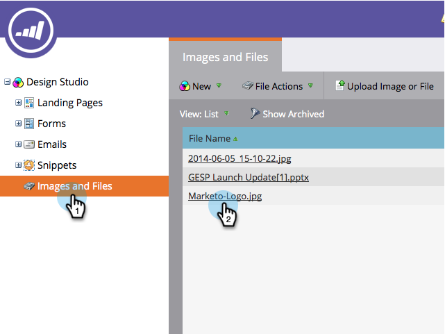

# Find the URL of an Uploaded Image or File {#find-the-url-of-an-uploaded-image-or-file}

Looking for the web address (URL) of an image or file you uploaded? Marketo's got you covered.

1. Go to the **[!UICONTROL Design Studio]**.

   

1. Click **[!UICONTROL Images and Files]** in the left menu and then select the file you want the URL for.

   

1. The **URL** is displayed on the details page. Right-click the **URL** and click **[!UICONTROL Copy]** in the menu that appears.

   

Give yourself a pat on the back for a job well done!

>[!MORELIKETHIS]
>
>[Replace an Uploaded Image or File](/help/marketo/product-docs/demand-generation/images-and-files/replace-an-uploaded-image-or-file.md)
