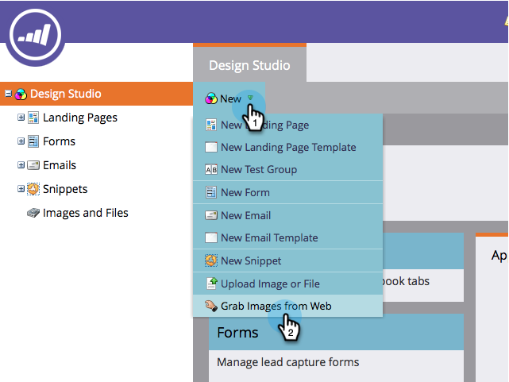
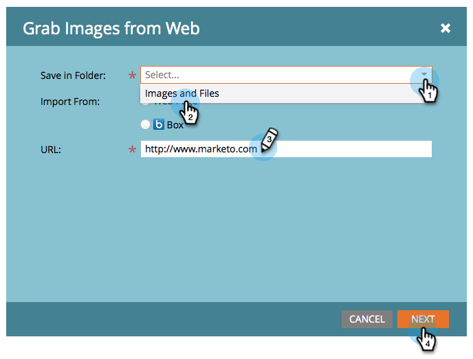
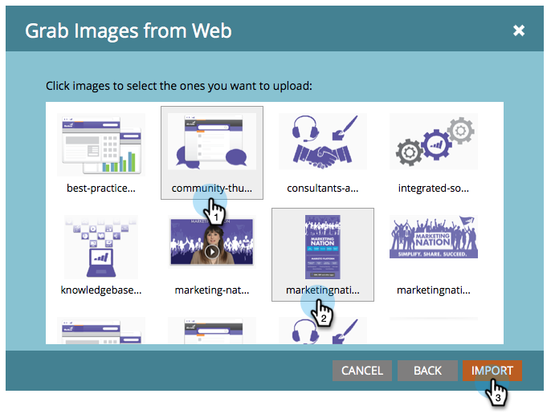
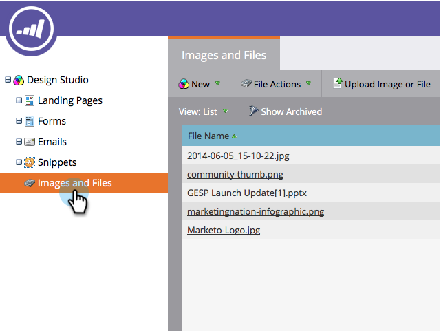

# Grab the Images from a Web Page {#grab-the-images-from-a-web-page}

To add images from a web page, copy the web address (URL) of the page that has the images you want, then follow these easy steps.

1. Go to **Design Studio**.

   

1. Click on **New** and **Grab Images from Web**.

   

1. Select the **Images and Files** folder, paste the web address (URL) into the URL text box, and click **Next**.

   

   >[!NOTE]
   >
   >This feature does not work with URLs that point directly to an image. Use the URL of the web page that contains the images.

1. Select the images you want to add and click **Import**.

   

1. Your images are now imported and available to use in emails and landing pages.

   

1. You can see all your available images in **Images and Files**.

   

Nice work, image master!

>[!MORELIKETHIS]
>
>* [Add Images and Files to Marketo](/help/marketo/product-docs/demand-generation/images-and-files/add-images-and-files-to-marketo.md)
>* [Organize Your Images and Files Using Folders](/help/marketo/product-docs/demand-generation/images-and-files/organize-your-images-and-files-using-folders.md)
>* [Find the URL of an Uploaded Image or File](/help/marketo/product-docs/demand-generation/images-and-files/find-the-url-of-an-uploaded-image-or-file.md)
>* [Upload Images and Files from Box](/help/marketo/product-docs/demand-generation/images-and-files/upload-images-and-files-from-box.md)
