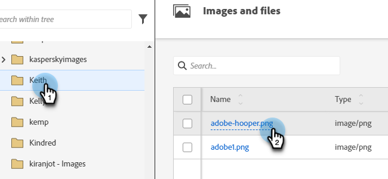
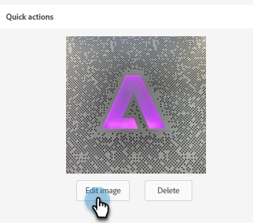
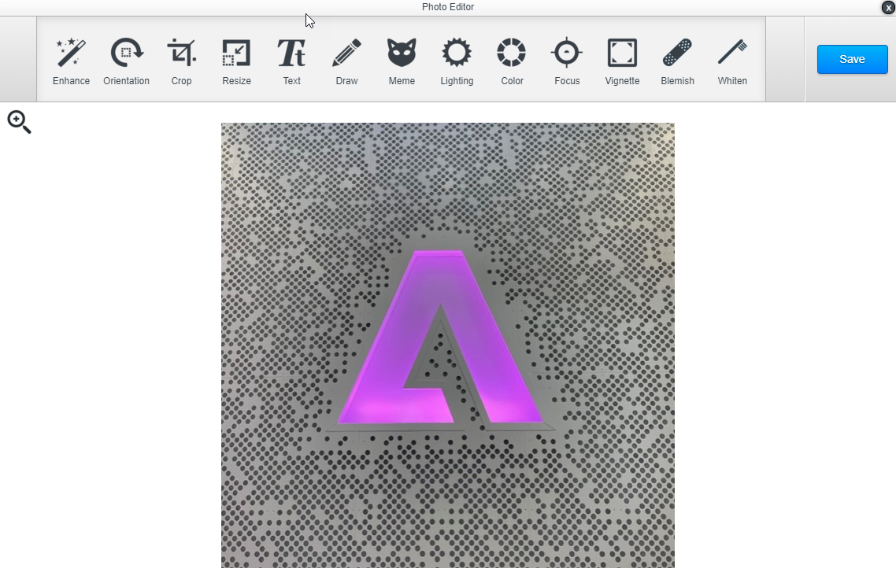

# Image Editor {#image-editor}

The image editor allows you to make quick, light edits to your images in Marketo Engage.

1. Go to the **[!UICONTROL Design Studio]**.

   

1. Locate and select your image.

   

1. Click the **[!UICONTROL Edit Image]** button.

   

1. Choose from a variety of functions in the toolbar at the top. Click **[!UICONTROL Save]** when done.

   
