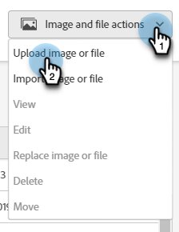
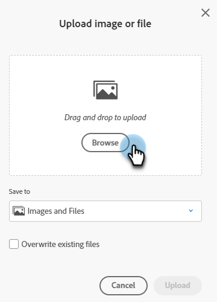
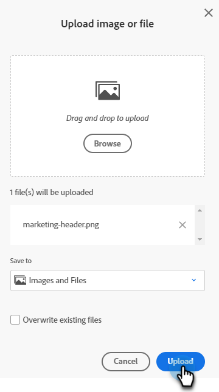
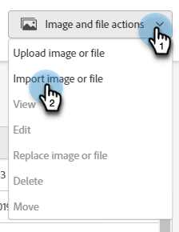
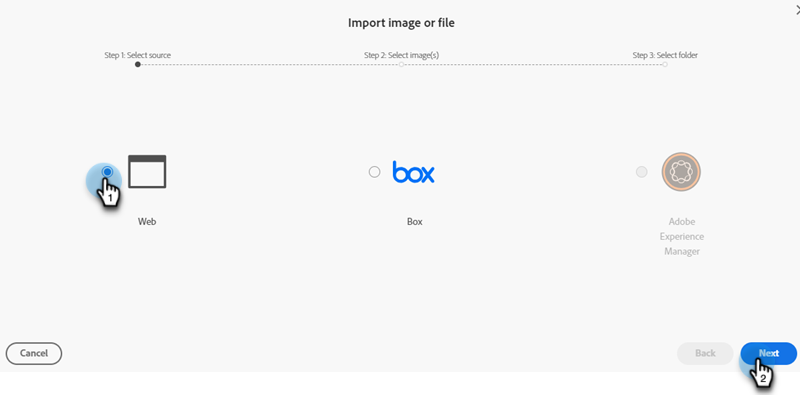
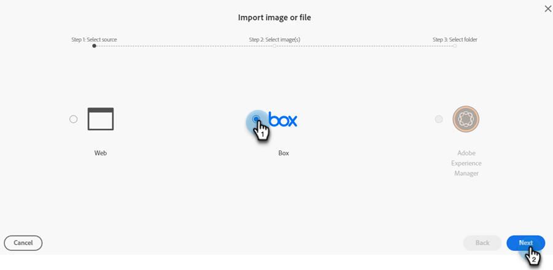
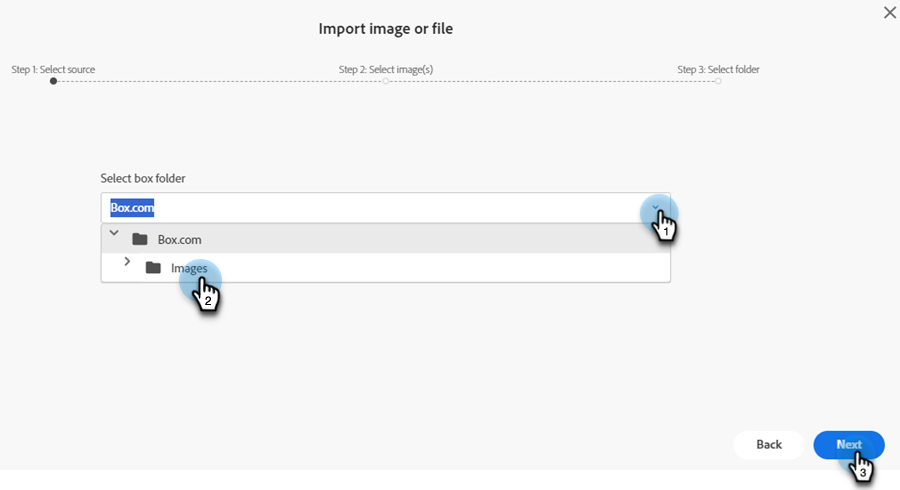
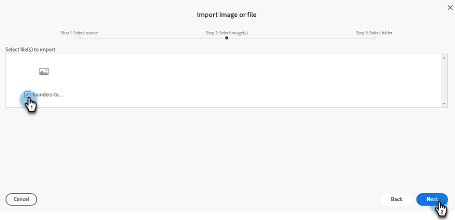
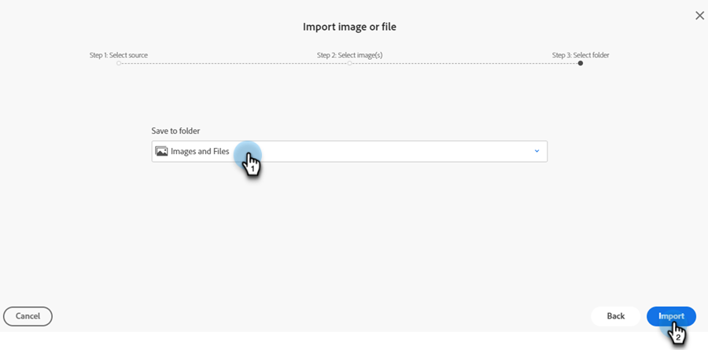
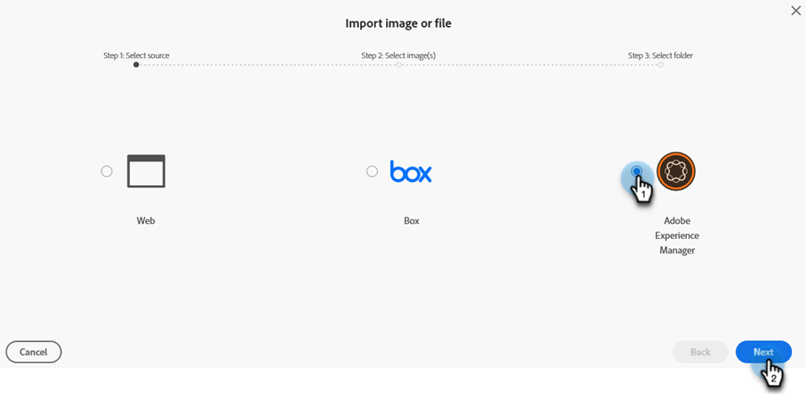

# New Add Images Doc {#new-add-images-doc}

You have multiple options for adding new files/images to your Images and Files repository.

## Upload Image or File {#upload-image-or-file}

1. Go to the **Design Studio**.

   

1. Select **[!UICONTROL Images and Files]** 

   

1. Click the **[!UICONTROL Image and file actions]** drop-down and select **[!UICONTROL Upload image or file]**.

   

1. Drag and drop the desired image/file, or browse your computer for it.

   

1. After the asset has been selected, click **Upload**.

   

## Import Image or File {#import-image-or-file}

You have three options for importing an image. Let's go over each of them.

### Import from the Web {#import-from-the-web}

Text

1. Follow Steps 1 and 2 [from above](#upload-image-or-file).

1. Click the **[!UICONTROL Image and file actions]** drop-down and select **[!UICONTROL Import image or file]**.

   

1. Select the **[!UICONTROL Web]** option and click **[!UICONTROL Next]**.

   

1. Type or paste in the URL to the desired image and click **Next**.

PICC

1. Click BLANK.

PICC

### Import from Box {#import-from-box}

Text

1. Follow Steps 1 and 2 [from above](#upload-image-or-file).

1. Click the **[!UICONTROL Image and file actions]** drop-down and select **[!UICONTROL Import image or file]**.

   

1. Select the **[!UICONTROL Box]** option and click **[!UICONTROL Next]**.

   

   >[!NOTE]
   >
   >If you haven't previously done so, you'll be asked to log in to your Box account to grant access.

1. Select the desired Box folder and click **[!UICONTROL Next]**.

   

1. Select the desired image(s) and click **[!UICONTROL Next]**.

   

1. Select the Marketo Engage folder you'd like the image saved to. In this example we'll leave it as Images and Files (default). Click **Import**.

   

### Import from Adobe Experience Manager {#import-from-adobe-experience-manager}

Text

1. Follow Steps 1 and 2 [from above](#upload-image-or-file).

1. Click the **[!UICONTROL Image and file actions]** drop-down and select **[!UICONTROL Import image or file]**.

   

1. Select the **[!UICONTROL Adobe Experience Manager]** option and click **[!UICONTROL Next]**.

   

   >[!NOTE]
   >
   >If you haven't previously done so, you'll be asked to sign in to your AEM account.

1. Text

PICC

1. Text

PICC

1. Text
