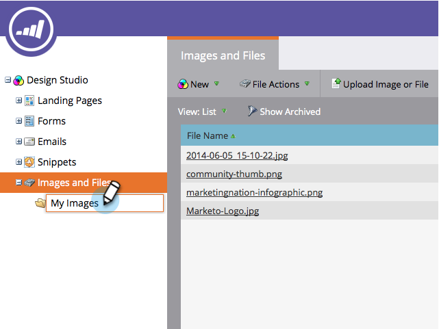
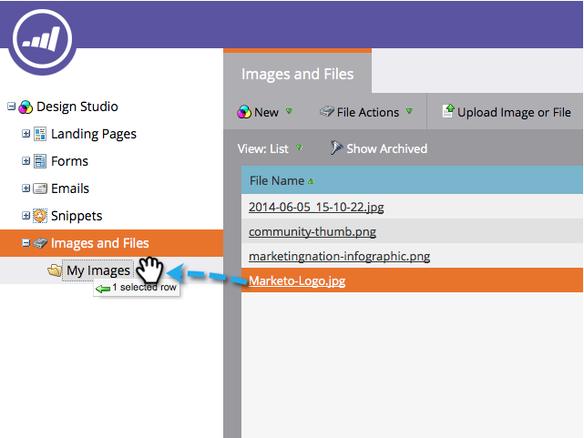

# Organize Your Images and Files Using Folders {#organize-your-images-and-files-using-folders}

Creating folders allows you to move images and files, see just the set of images you want, and upload directly to a specific folder.  

1. Go to the **Design** **Studio**.

   

1. Right-click on** Images and Files** in the left menu, then select **New Folder**.

   

1. After the new folder appears, give it a name.

   

1. Go to **Images and Files**, now you can drag and drop into the folder you want.

   

High five! You're all set for folder utopia. 

>[!MORELIKETHIS]
>
>* [Search Uploaded Images and Files](search-uploaded-images-and-files.md)
>

