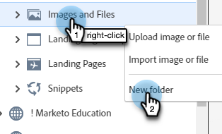
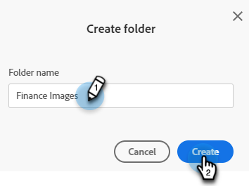
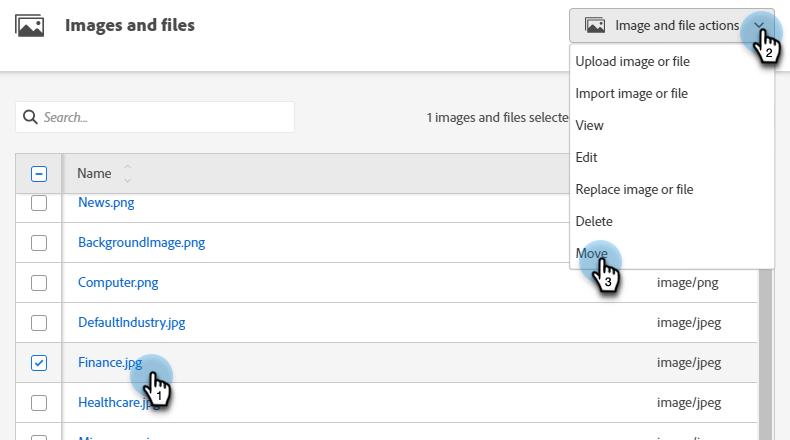
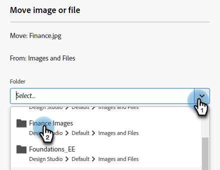

# Organize Your Images and Files Using Folders {#organize-your-images-and-files-using-folders}

Creating folders allows you to move images and files, see just the set of images you want, and upload directly to a specific folder.

1. Go to the **[!UICONTROL Design Studio]**.

   

1. Right-click on **[!UICONTROL Images and Files]** and select **[!UICONTROL New folder]**.

   

1. Name your folder and click **[!UICONTROL Create]**.

   

1. Go back to **[!UICONTROL Images and Files]** and select the asset you want to move. Click the **[!UICONTROL Image and file actions]** drop-down and select **[!UICONTROL Move]**.

   

1. Select the desired folder.

   

1. Click **M[!UICONTROL ]ove**.

   

>[!MORELIKETHIS]
>
>[Search Uploaded Images and Files](/help/marketo/product-docs/demand-generation/images-and-files/search-uploaded-images-and-files.md){target="_blank"}
