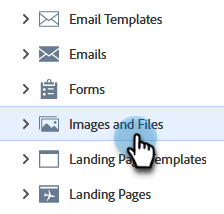
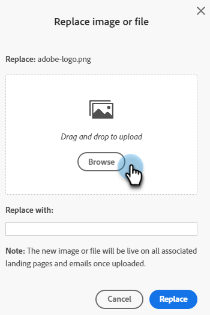
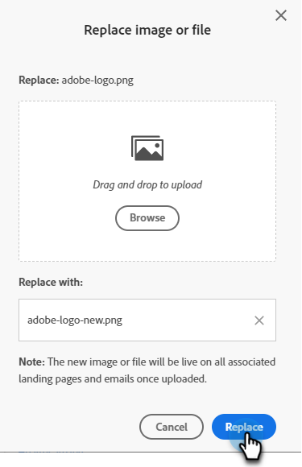

# Replace an Uploaded Image or File {#replace-an-uploaded-image-or-file}

1. Go to the **[!UICONTROL Design Studio]**.

   

1. Click **[!UICONTROL Images and Files]**.

   

1. Select the asset you want to replace. Click the **[!UICONTROL Image and file actions]** drop-down and select **[!UICONTROL Replace image or file]**.

   

1. Drag and drop or browse your computer for the replacement image/file.

   

   >[!NOTE]
   >
   >The replacement file type must be the same as the original (e.g., .jpg)

1. After you've selected the replacement image/file, click **[!UICONTROL Replace]**.

   

   >[!NOTE]
   >
   >The name of the replacement file will change to match the previous file's name.

Good job!

>[!MORELIKETHIS]
>
>* [Search Uploaded Images and Files](/help/marketo/product-docs/demand-generation/images-and-files/search-uploaded-images-and-files.md){target="_blank"}
>* [Find the URL of an Uploaded Image or File](/help/marketo/product-docs/demand-generation/images-and-files/find-the-url-of-an-uploaded-image-or-file.md){target="_blank"}
