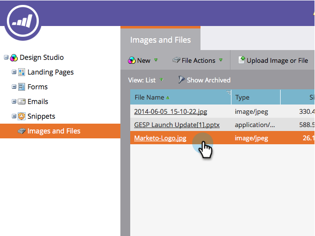
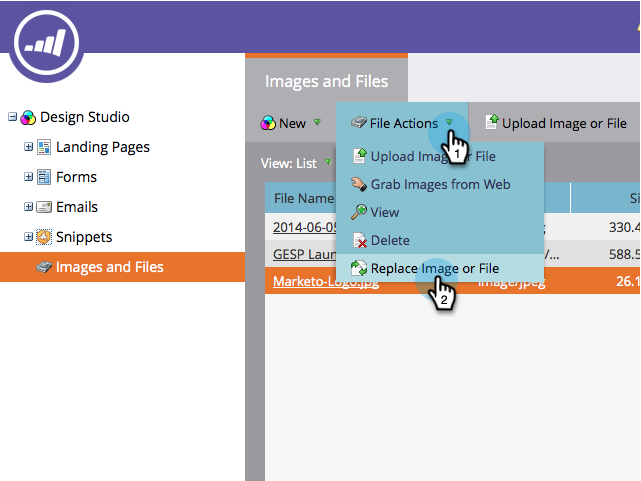
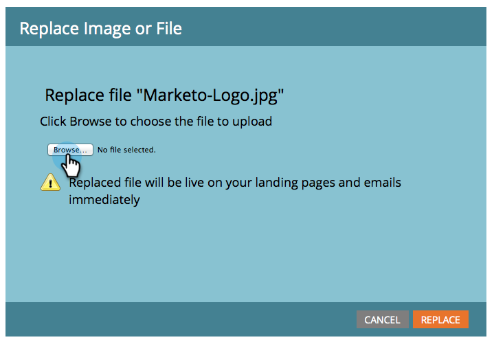
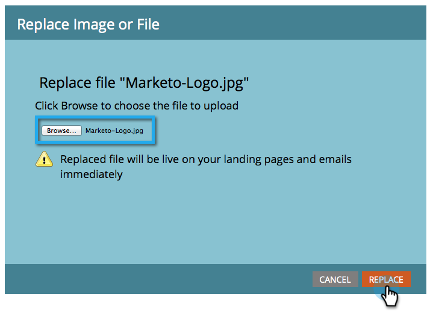

# Replace an Uploaded Image or File {#replace-an-uploaded-image-or-file}

1. Go to the **Design** **Studio**.

   

1. Click **Images** **and** **Files**, then select the file you want to replace.

   

   >[!TIP]
   >
   >You can also  [search uploaded images or files](search-uploaded-images-and-files.md). 

1. Click **File Actions** and select **Replace Image or File**.

   

1. Browse to the file on your computer that will replace the current file, then select it.

   

   >[!NOTE]
   >
   >If you're unable to select a file from a shared folder, please save that file to your hard drive and choose it from there.

1. Verify that the file displayed next to **Choose File** is correct, then click **Replace**. 

   

>[!NOTE]
>
>The name of the replacement file will change to match the previous file name.

You did it! 

>[!MORELIKETHIS]
>
>* [Search Uploaded Images and Files](search-uploaded-images-and-files.md)
>* [Find the URL of an Uploaded Image or File](find-the-url-of-an-uploaded-image-or-file.md)
>

