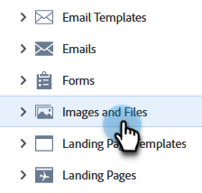
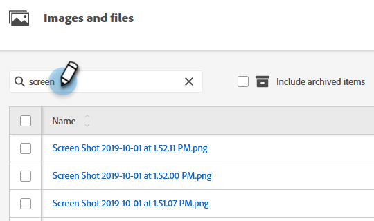

# Search Uploaded Images and Files {#search-uploaded-images-and-files}

Learn how to perform a search for an image or file.

1. Go to the **[!UICONTROL Design Studio]**.

   

1. Click **[!UICONTROL Images and Files]** for the complete list of all uploaded files.

   

1. In the Search box, type the word that the file begins with and hit **Enter**.

   

>[!NOTE]
>
>Images and Files search only utilizes "begins with" functionality at this time.

>[!MORELIKETHIS]
>
>* [Replace an Uploaded Image or File](/help/marketo/product-docs/demand-generation/images-and-files/replace-an-uploaded-image-or-file.md){target="_blank"}
>* [Organize Your Images and Files Using Folders](/help/marketo/product-docs/demand-generation/images-and-files/organize-your-images-and-files-using-folders.md){target="_blank"}
