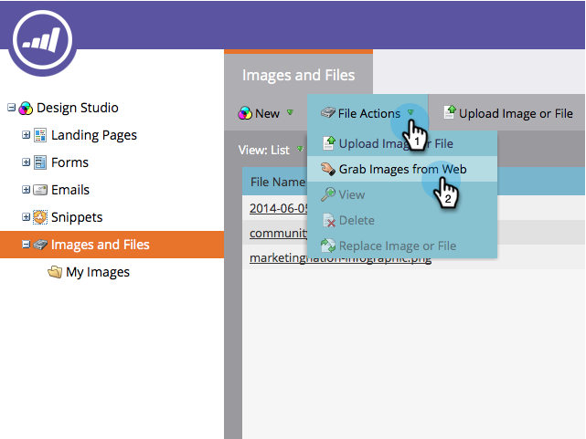
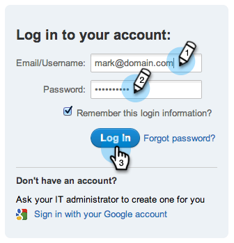
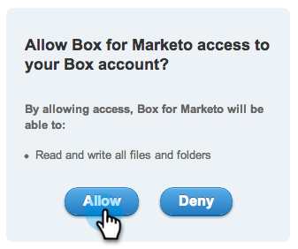
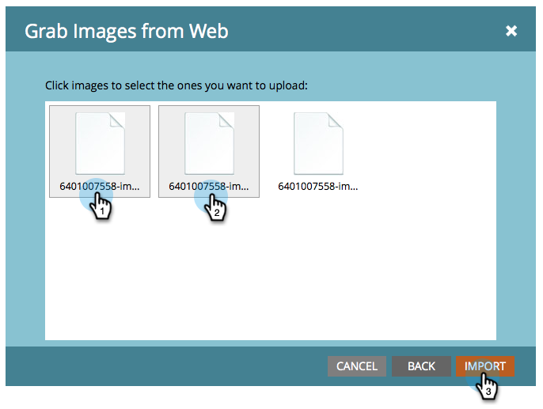

# Upload Images and Files from Box {#upload-images-and-files-from-box}

You can upload files from Box to use on landing pages and emails.

1. Go to **Design** **Studio**.

   

1. Go to** Images and Files**. Click **File Actions** and select **Grab Images from Web**.

   

1. Click **Box**. 

   

1. Enter your Box login.

   

1. Allow Marketo to access your Box account.

   

1. Choose where you want to save the files. Then select the **Box** folder you want to upload from. Click **Next**.

   

1. Select the files you want to upload. Click **Import**.

   

Your files are now ready to be used on your landing pages and emails! 