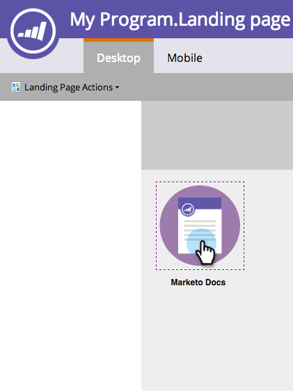
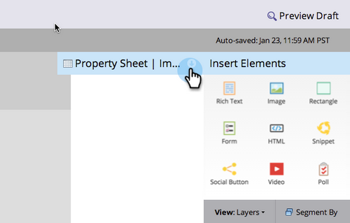

# Add a Link to an Image in a Free-Form Landing Page {#add-a-link-to-an-image-in-a-free-form-landing-page}

Want to make an image on your landing page a link to another page/site? Here's how.

>[!NOTE]
>
>**Prerequisites**
>
>* [Add an Image to a Free-Form Landing Page](add-an-image-to-a-free-form-landing-page.md)
>

1. Click the image you'd like to add a link to.

   

1. Expand the **Property Sheet**.

   

1. Copy or type the link into the **linkUrl **box.

   

   Congratulations! You've now successfully added a link to an image on your landing page. You can now [preview the page](../../../../product-docs/demand-generation/landing-pages/landing-page-actions/preview-a-landing-page.md) to see it in action.

>[!TIP]
>
>Always test your pages!

>[!NOTE]
>
>**Related Articles**
>
>* [Preview a Landing Page](../../../../product-docs/demand-generation/landing-pages/landing-page-actions/preview-a-landing-page.md)
>

