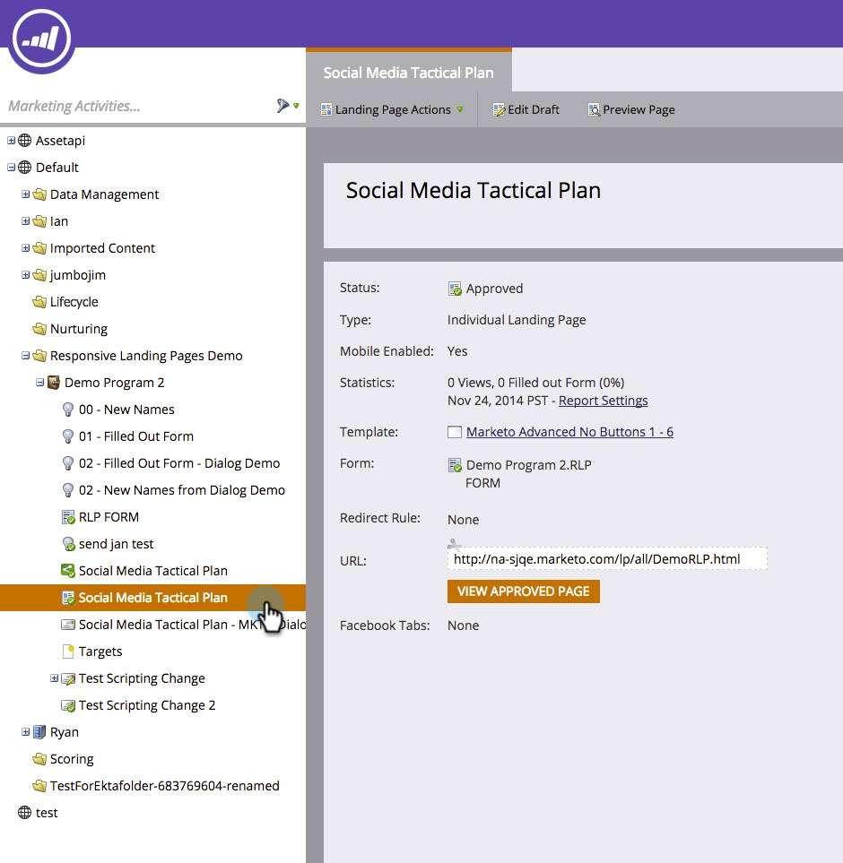
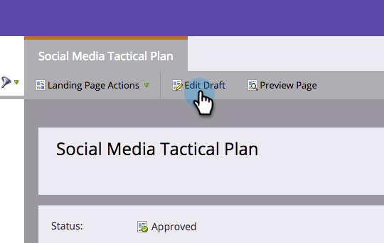

# Add a Mobile View for Your Free-Form Landing Page {#add-a-mobile-view-for-your-free-form-landing-page}

It's easy to make your free-form landing pages look great on a smartphone.

>[!NOTE]
>
>The mobile view works on screens that are 480px wide (or less). In other words, smartphones. Here's more [info on device resolutions](https://www.mydevice.io/).

1. Go to **Marketing Activities**.

   

1. Select a free-form landing page.

   

1. Click **Edit Draft**.

   

1. Click the **Mobile** tab.

   

1. Click **Activate**.

   

   >[!CAUTION]
   >
   >The free-form template may need to be upgraded. If you see that message, quickly read about how to [make an existing free-form landing page template mobile compatible](/help/marketo/product-docs/demand-generation/landing-pages/landing-page-templates/make-an-existing-free-form-landing-page-template-mobile-compatible.md).

1. Great! You have now activated the mobile version of your landing page. Click **Close**.

   

   You can now [customize your mobile view](/help/marketo/product-docs/demand-generation/landing-pages/free-form-landing-pages/customize-mobile-view-for-your-free-form-landing-page.md).

   
