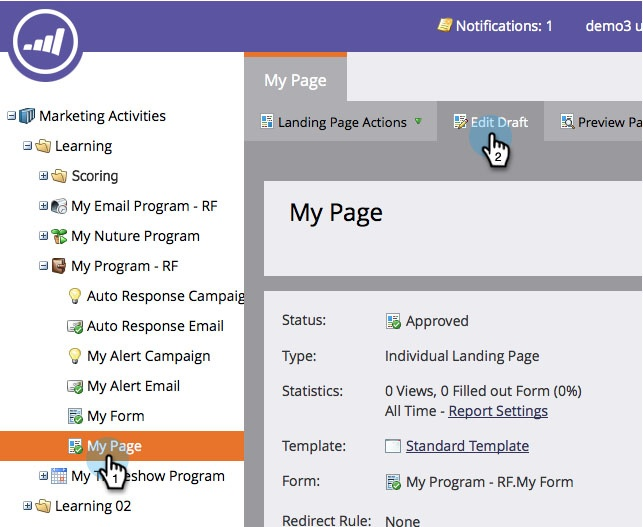
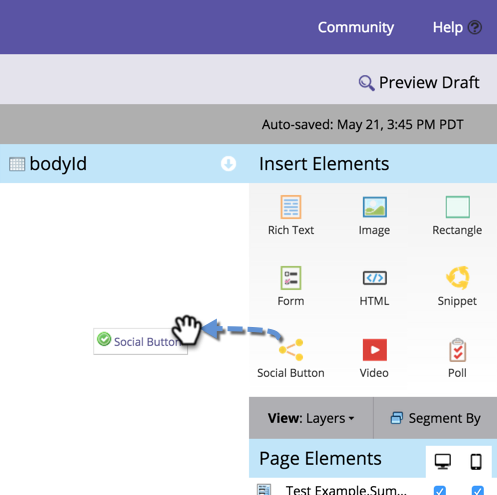

# Add a Social Button to a Free-form Landing Page {#add-a-social-button-to-a-free-form-landing-page}

A social button encourages people to share your content with their friends. Drop it on free-form landing pages, Facebook, and your website.

>[!NOTE]
>
>**Availability**
>
>Not all customers have purchased this functionality. Contact your sales rep for details.

>[!TIP]
>
>1. Navigate to your free-form landing page and click **Edit Draft**. 
>
>   >
>1. Drag over **Social** **Button** from the elements on the right.
>
>   >
>1. Select **Social Buttons (with Analytics).**
>
>   >
>   Once your landing page is active, see the activity generated by your social button (with Analytics) on the [Social Dashboard](../../../../product-docs/demand-generation/social/social-functions/view-social-performance.md).
>
>   If you add a Like/Recommend Button (Lite) instead, see the number of shares in the [landing page performance report](../../../../product-docs/demand-generation/landing-pages/understanding-landing-pages/landing-page-performance-report.md). 
>
>1. Select **Create New** from the drop-down menu.
>
>   >[!NOTE]
>   >
>   >You can also create a social button inside a program by selecting **New** > **New Local Asset.** 

>
>1. Name your social button, select **None** from **Clone From,** and click **Insert.**
>
>   >
>   >[!TIP]
>   >
>   >To save time, you can use the **Clone** **From** option to copy all settings from an existing social button. 

>
>   [publish the landing page to Facebook](../../../../product-docs/demand-generation/facebook/publish-landing-pages-to-facebook.md) [put the social button on your website](../../../../product-docs/demand-generation/social/social-functions/deploy-social-on-your-website.md)
>
>Congratulations! You have added a social button to your landing page. Be sure to approve the landing page. You can also  or . >
>>[!NOTE]
>>
>>**Related Articles**
>
>>You're done, but you can change the settings of your social button if necessary. Start with [customizing the button style](../../../../product-docs/demand-generation/social/configuring-social-actions/customize-social-app-button.md) or  [editing the share messages](../../../../product-docs/demand-generation/social/configuring-social-actions/configure-social-sign-up-share-flow.md) it presents. 

>

