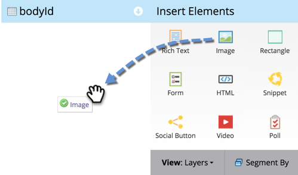
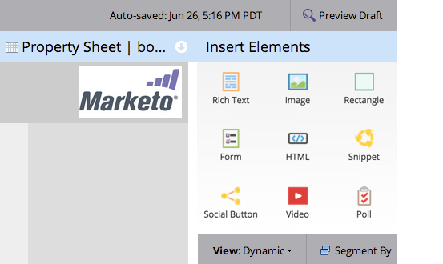

# Add an Image to a Free-Form Landing Page {#add-an-image-to-a-free-form-landing-page}

>[!PREREQUISITES]
>
>[Add Images and Files to Marketo](/help/marketo/product-docs/demand-generation/images-and-files/add-images-and-files-to-marketo.md)

1. Select your free-form landing page and click **[!UICONTROL Edit Draft]**.

   

1. In the editor, drag over the **[!UICONTROL Image]** element.

   

1. Find and select the image of your choice.

   

1. Click **[!UICONTROL Insert]**.

   

   Great job! You just added an image to your free-form landing page.

   
