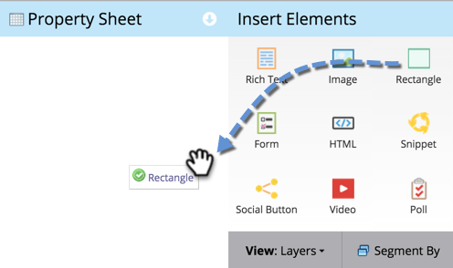
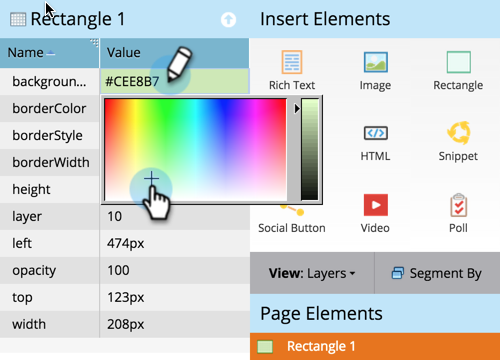

# Adding a Rectangle to a Free-Form Landing Page {#adding-a-rectangle-to-a-free-form-landing-page}

Adding a Rectangle to a Free-Form Landing Page - Marketo Docs - Product Documentation

Rectangles on landing pages are great for highlighting an area of the text.

1. Select a free-form landing page and click on **Edit** **Draft**.

   

   >[!NOTE]
   >
   >The free-form landing page designer opens in a new window.

1. Drag over the **Rectangle** element.

   

1. Select your rectangle and use the **Property** **Sheet** to make any changes needed.

   >[!TIP]
   >
   >You can move and resize the rectangle using drag and drop.&nbsp;Also try the arrows on the keyboard!&nbsp;Hint: Press Shift-Arrow to move the rectangle 10px at a time.

   

Congratulations! You now have the ability to create rectangles on your free-form landing pages.
