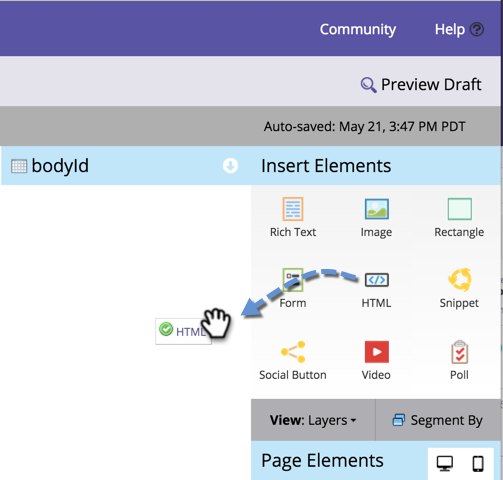

# Adding Custom HTML to a Free-Form Landing Page {#adding-custom-html-to-a-free-form-landing-page}

You can add custom scripts, CSS, or other HTML to landing pages.

>[!NOTE]
>
>Marketo Support is not set up to assist with troubleshooting custom HTML. For HTML assistance, please consult a web developer.

1. Select your landing page and click **Edit Draft.**

   

1. In the landing page editor, drag in the **HTML** element.

   

1. Enter your custom HTML code and click **Save.**

   

Nice! Put any scripts or CSS you want in there.

>[!TIP]
>
>Whenever possible, test your custom HTML source in a local environment before deploying it in a landing page.

>[!CAUTION]
>
>If your custom HTML is non-rendering (such as an invisible JavaScript function or CSS), put the element in a memorable location like the top left. The element outline is only visible when you click in its area.

