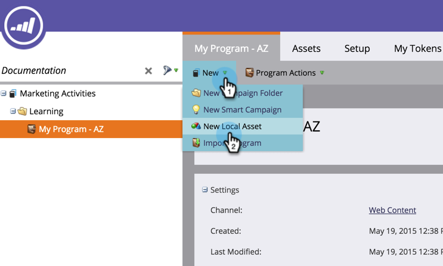
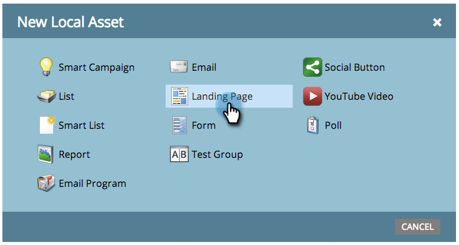
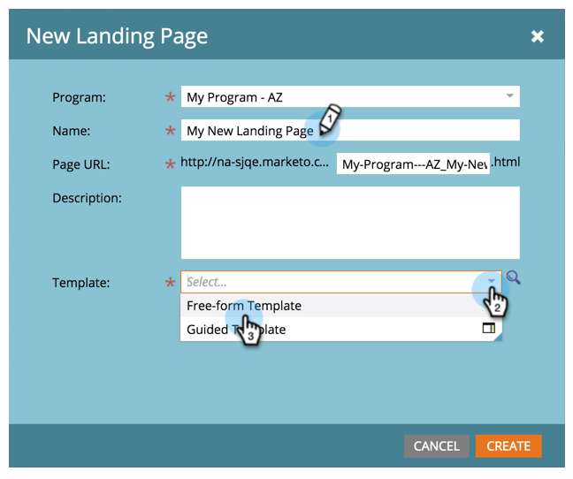
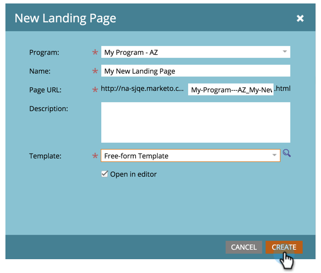
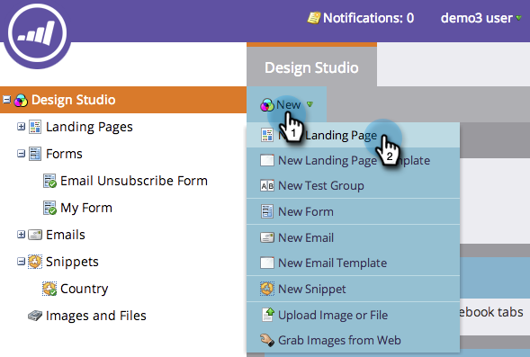
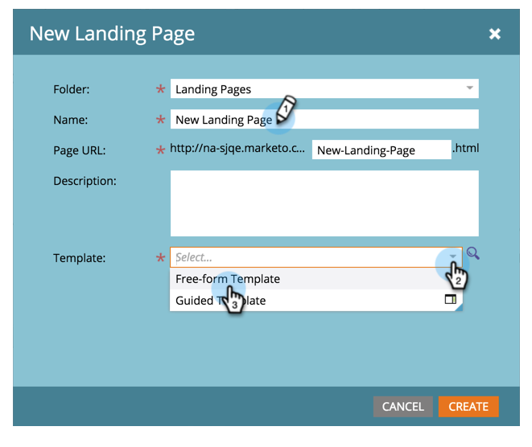

# Create a Free-Form Landing Page {#create-a-free-form-landing-page}

Free-form landing pages can be created as local assets of a program or in the Design Studio to be used globally.

>[!NOTE]
>
>Landing page modes are defined by their template. [Learn more](../../../../product-docs/demand-generation/landing-pages/understanding-landing-pages/understanding-free-form-vs-guided-landing-pages.md) about free-form and guided landing page templates.

### What's in this article? {#whats-in-this-article}

[Create a Free-Form Landing Page in a Program](#create-a-free-form-landing-page-in-a-program)  
[Create a Free-Form Landing Page in Design Studio](#create-a-free-form-landing-page-in-design-studio)

#### Create a Free-Form Landing Page in a Program {#create-a-free-form-landing-page-in-a-program}

1. Go to **Marketing Activities**.

   

1. Click on your program.  

   

1. Click **New**. Select **New Local Asset**.

   

1. Click on **Landing Page**.

   

1. Name your landing page and choose free-form template from the drop-down.

   >[!NOTE]
   >
   >Templates without an icon are free-form. Free-form templates allow full customization.

   

1. Click **Create**.

   

>[!TIP]
>
>The URL is constructed automatically from the program and landing page names. To change the URL, edit the **Page URL** field.

#### Create a Free-Form Landing Page in Design Studio {#create-a-free-form-landing-page-in-design-studio}

1. Go to the **Design** **Studio**. 

   

1. Click **New**, then **New Landing Page.** 

   

1. Name your landing page and choose free-form template from the drop-down.

   

1. Click **Create**.

   

>[!TIP]
>
>Uncheck "Open landing page editor for new page" if you don't want the editor to open immediately after clicking **Create**.

