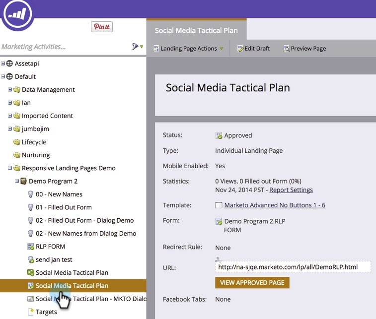

# Customize Mobile View for Your Free-Form Landing Page {#customize-mobile-view-for-your-free-form-landing-page}

>[!PREREQUISITES]
>
>[Add a Mobile View for Your Free-Form Landing Page](/help/marketo/product-docs/demand-generation/landing-pages/free-form-landing-pages/add-a-mobile-view-for-your-free-form-landing-page.md)

The mobile view of your free-form landing page is mostly automatic, but you can customize it. Here's how.

1. Select your free-form landing page.

   

1. Click **[!UICONTROL Edit Draft]**.

   

1. Click the **[!UICONTROL Mobile]** tab.

   

## Mobile vs. Desktop View {#mobile-vs-desktop-view}

Under Page Elements, you'll see a  (desktop) icon and a  (mobile) icon. This allows you to show/hide different elements dynamically.

By default, everything on the desktop view is shown on the mobile view.

>[!NOTE]
>
>Rectangles aren't shown on the mobile view.

## Important Things to Know: {#important-things-to-know}

* Images will expand to the width of your mobile device. If you want smaller images, pull in the rich-text element and add your image from there.
* Only use Forms 2.0 forms. They are responsive and will adjust automatically.
* Only one template element is editable, BODY#bodyid (Mobile). You can use this to change the background color.

  

## Hide an Element from the Mobile View {#hide-an-element-from-the-mobile-view}

>[!TIP]
>
>Less is more on mobile. Use fewer words for happier customers.

1. To hide an element, click the corresponding check box under the mobile column.

   

1. Perfect! That element will no longer be visible in your mobile view.

   

## Add an Element to the Mobile View {#add-an-element-to-the-mobile-view}

>[!TIP]
>
>Make special (shorter) content just for the mobile view.

1. To add an element, drag-and-drop it onto the free-form landing page.

   

   Make sure the element is set to display only on the mobile view.

   

>[!TIP]
>
>The mobile view can also have a different arrangement of page elements. Move things around on the free-form landing page, or reorder the objects listed under **[!UICONTROL Page Elements]** using drag and drop.

## Preview Mobile View {#preview-mobile-view}

1. Click **[!UICONTROL Preview Draft]**.

   

1. Want to see something cool? Select **[!UICONTROL Side By Side]**.

   

1. You can now see the desktop and mobile versions of your landing pages at the same time!

   

1. If you love it, click **[!UICONTROL Approve and Close]**.

   

   >[!NOTE]
   >
   >The preview is not interactive. Every smartphone displays things a bit differently. We recommend previewing your landing page on a few devices to see exactly how the landing page will behave.

Have fun!

>[!MORELIKETHIS]
>
>[Make an Existing Free-form Landing Page Template Mobile Compatible](/help/marketo/product-docs/demand-generation/landing-pages/landing-page-templates/make-an-existing-free-form-landing-page-template-mobile-compatible.md)
