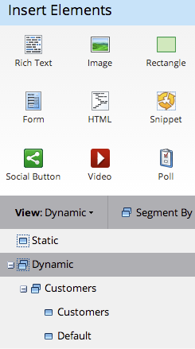
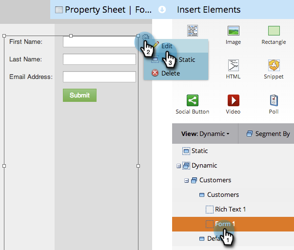

# Use Dynamic Content in a Free-form Landing Page {#use-dynamic-content-in-a-free-form-landing-page}

Using Dynamic Content in Landing Pages engages your audience with targeted information.

>[!PREREQUISITES]
>
>* [Create a Segmentation](/help/marketo/product-docs/personalization/segmentation-and-snippets/segmentation/create-a-segmentation.md)
>* [Create a Free-Form Landing Page](/help/marketo/product-docs/demand-generation/landing-pages/free-form-landing-pages/create-a-free-form-landing-page.md)
>* [Add a New Form to a Free-Form Landing Page](/help/marketo/product-docs/demand-generation/landing-pages/free-form-landing-pages/add-a-new-form-to-a-free-form-landing-page.md)

## Add Segmentation {#add-segmentation}

1. Go to **Marketing Activities**.

   

1. Select your Landing Page, then click **Edit Draft**.

   

1. Click **Segment By**.

   

1. Enter the Segmentation name and click **Save**.

   

1. Your segmentation and its segments appear under Dynamic on the right.

   

>[!NOTE]
>
>All landing page elements are Static by default.

## Make Element Dynamic {#make-element-dynamic}

1. Drag and drop the dynamic content elements from under **Static** to **Dynamic**.

   

1. You can also make elements **Static** or **Dynamic** from the element **Settings**.

   

## Apply Dynamic Content {#apply-dynamic-content}

1. Select an element under a segment, click the settings icon, then click **Edit**. Repeat for each segment.

   

1. A green check mark indicates content specific to that segment. A blank indicates default segment content.

   

>[!CAUTION]
>
>Changes to Default segment content block gets applied to all segments.

>[!TIP]
>
>Create a default landing page before modifying content for the various segments.

Voila! You can now send targeted content.

>[!MORELIKETHIS]
>
>* [Preview a Landing Page with Dynamic Content](/help/marketo/product-docs/demand-generation/landing-pages/landing-page-actions/preview-a-landing-page-with-dynamic-content.md)
>* [Using Dynamic Content in an Email](/help/marketo/product-docs/email-marketing/general/functions-in-the-editor/using-dynamic-content-in-an-email.md)
