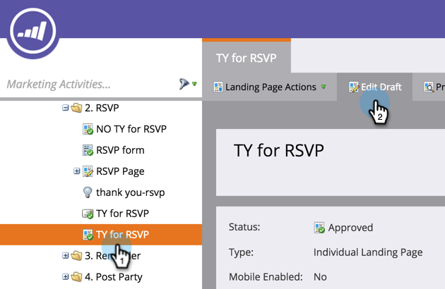
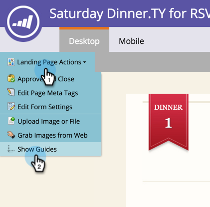

# Use Guides for Free-form Landing Page Design {#use-guides-for-free-form-landing-page-design}

When designing a free-form landing page, you can use guides to help with aligning the components.

>[!NOTE]
>
>Guides are only available on the **[!UICONTROL Free-form]** landing page editor.

1. Select a **[!UICONTROL Landing Page]** and click **[!UICONTROL Edit Draft]**.

   

1. Click **[!UICONTROL Landing Page Actions]** and select **[!UICONTROL Show Guides]**.

   

1. A vertical and horizontal guide will appear over the canvas. Use the cursor to move them.

   

1. Drag an object over the line. Let go when the line doubles in width and the object will snap to the guide.

   

   Aligned objects are easy on the eyes!
