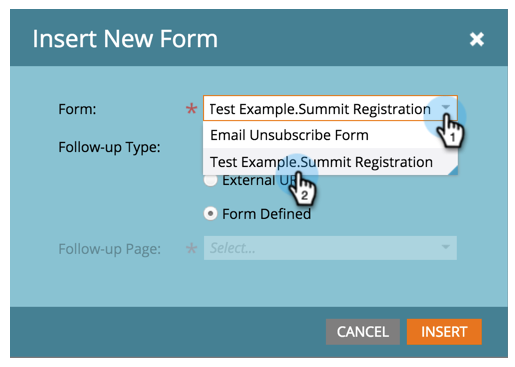

# Add a Form to a Guided Landing Page {#add-a-form-to-a-guided-landing-page}

Form, meet landing page. Landing page, meet form.

>[!NOTE]
>
>**Prerequisites**
>
>* [Create a Guided Landing Page](create-a-guided-landing-page.md)
>

1. Go to the **Marketing Activities** area.

   

1. Find and select your landing page and click **Edit Draft**.

   

   >[!NOTE]
   >
   >Available elements in guided landing pages are defined by the template. If you do not see a form in the elements panel, select a new template or talk to your template creator.

1. Double-click the **Form** in the element panel.

   

1. Select the form you want to add.

   

1. You have three options when choosing your follow-up page:

    * Landing Page - pick a Marketo landing page
    * External URL - pick any URL you want
    * Form Defined - use the settings defined at the form level

   >[!NOTE]
   >
   >The follow-up page is the page people will see after they submit the form.

1. In this example we'll use Form Defined. Click **Insert**.

   

   Nicely done! 

   

Now just close the landing page editor and [approve the landing page draft](../../../../product-docs/demand-generation/landing-pages/understanding-landing-pages/approve-unapprove-or-delete-a-landing-page.md).
