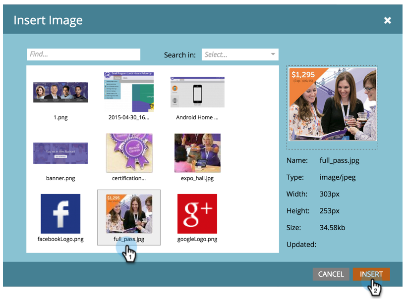
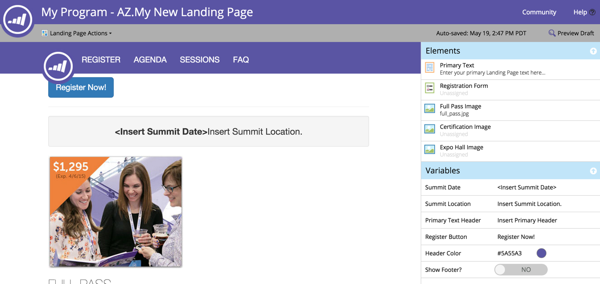

# Add an Image to a Guided Landing Page {#add-an-image-to-a-guided-landing-page}

Unlike the free-form landing pages, guided landing pages have predefined, locked spaces where you add images.

1. Select a guided landing page. Click **Edit Draft**.

   

1. Click the image you want to edit. The element placeholder will illuminate in the landing page canvas.

   

1. Select the image you want and click **Insert**.

   

1. The content will display in the element place holder.

   >[!NOTE]
   >
   >How the image resizes is dependent on the template. Learn more about [Guided Landing Page Templates](/help/marketo/product-docs/demand-generation/landing-pages/landing-page-templates/create-a-guided-landing-page-template.md).

   

   >[!TIP]
   >
   >Specifying a link for an image in the editor is not currently supported. Use a rich text element instead.
