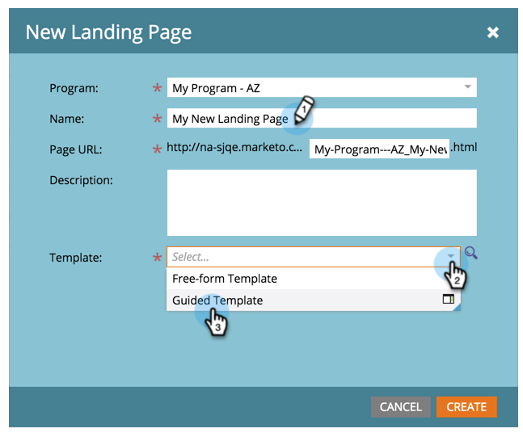
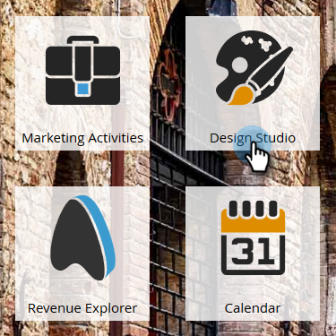
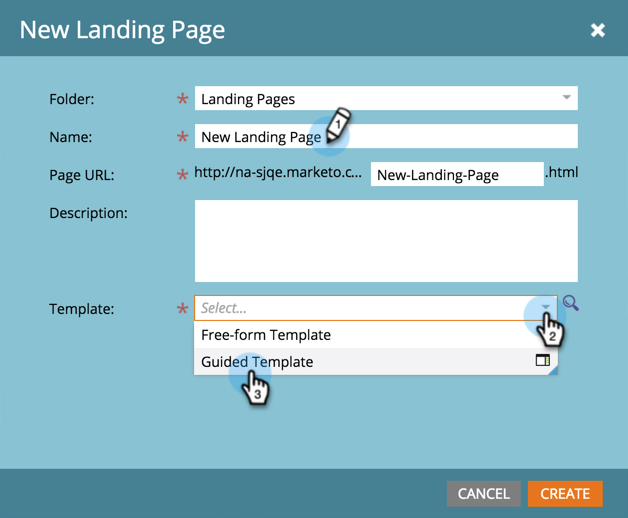

# Create a Guided Landing Page {#create-a-guided-landing-page}

>[!NOTE]
>
>Landing page modes are defined by their template. [Learn more](/help/marketo/product-docs/demand-generation/landing-pages/understanding-landing-pages/understanding-free-form-vs-guided-landing-pages.md) about free-form and guided landing page templates.

>[!PREREQUISITES]
>
>To use a custom template, you must first [create a guided landing page template](/help/marketo/product-docs/demand-generation/landing-pages/landing-page-templates/create-a-guided-landing-page-template.md).

## Create a Guided Landing Page in a Program {#create-a-guided-landing-page-in-a-program}

Guided landing pages can be created as local assets of a program or in the Design Studio to be used globally.

1. Go to **Marketing Activities**.

   

1. Select your program.

   

1. Click the **New** drop-down. Select **New Local Asset**.

   

1. Select **Landing Page**.

   

1. Name your landing page. Click the **Template** drop-down and select **Guided Template**.

   >[!NOTE]
   >
   >Guided landing page templates have the  icon next to them. Guided templates are structured so they can remain fully responsive.

   

## Create a Landing Page in Design Studio {#create-a-landing-page-in-design-studio}

1. Go to **Design Studio**.

   

1. Click the **New** drop-down. Select **New Landing Page**.

   

1. Name your landing page. Click the **Template** drop-down and select **Guided Template**.

   

1. Click **Create**.

   

>[!TIP]
>
>The URL is constructed automatically from the program and landing page names. To change the URL, edit the **Page URL** field.
>
>Clear the **Open in editor** checkbox if you don't want the editor to open immediately after clicking **Create**.
