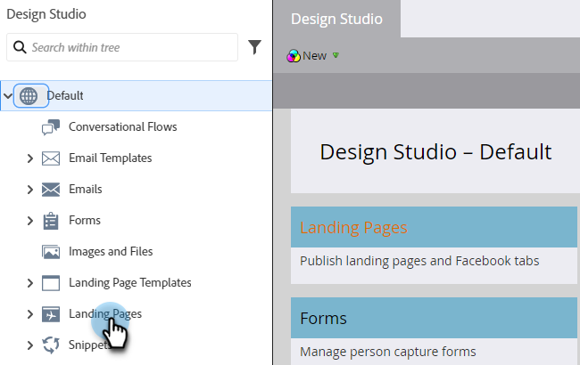
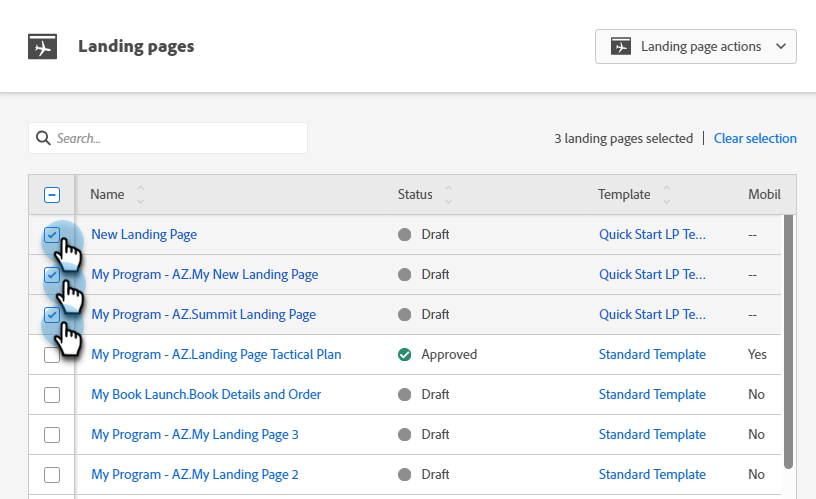
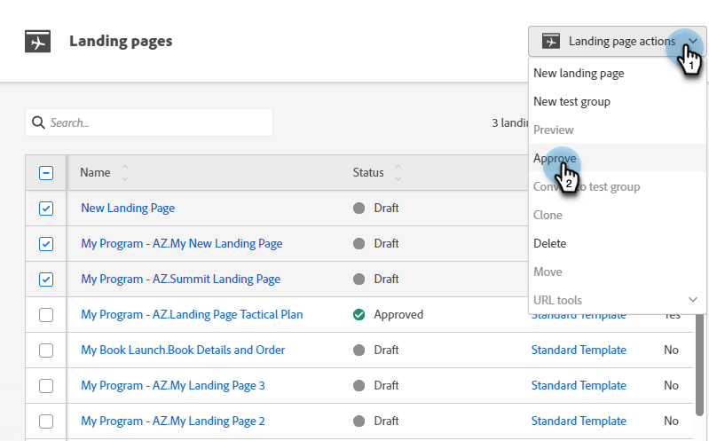
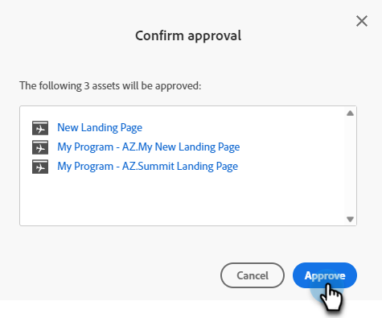

# Approve Multiple Landing Pages at Once {#approve-multiple-landing-pages-at-once}

1. Go to **Design Studio**.

   

1. Click **Landing Pages**.

   

1. Select the desired Landing Pages.

   

   >[!TIP]
   >
   >Do not click the actual Landing Page name, those are links and will take you to the page itself.

1. With your Landing Pages selected, click the **Landing Page Actions** drop-down and select **Approve**.

   

1. Click **Approve**.

   

   >[!TIP]
   >
   >You can also use the steps above for other bulk options, such as unapprove or delete.
