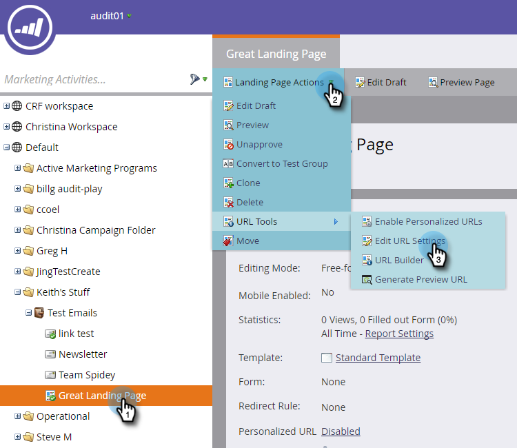
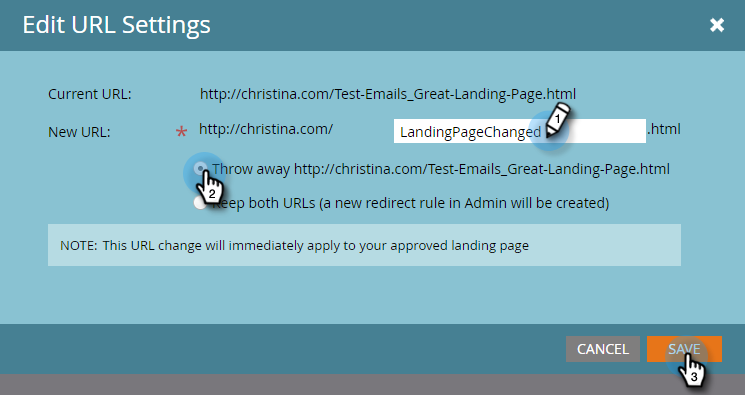

# Change the Landing Page URL {#change-the-landing-page-url}

You can modify a landing page's URL. This can help make the URL easier to remember, and improve SEO.

1. Select your landing page. Click the **Landing Page Actions** drop-down, scroll to **URL Tools** and select **Edit URL Settings**.

   

1. Enter the **New URL**, choose to have the old URL discarded or redirected, and click **Save**.

   

   >[!NOTE]
   >
   >If you decide you want to keep both URLs, a redirect rule will be created automatically. Learn more about [URL redirects](/help/marketo/product-docs/demand-generation/landing-pages/personalizing-landing-pages/redirect-a-url-path.md).
