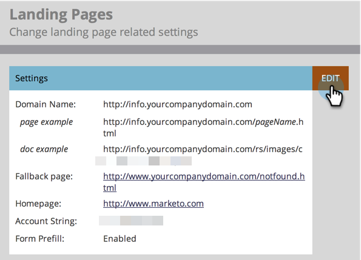
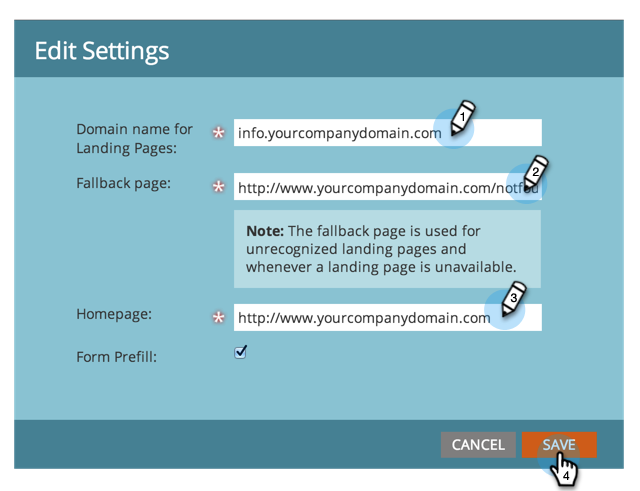

# Customize Your Landing Page URLs with a CNAME {#customize-your-landing-page-urls-with-a-cname}

Even though Marketo hosts your landing pages, the URL can be totally customized. What it looks like without a CNAME:

`https://na-sj02.marketo.com/lp/mktodemoaccount126/UnsubscribePage.html`

The way it should look:

`https://go.YourCompany.com/UnsubscribePage.html`

## Choose a CNAME {#choose-a-cname}

Pick a word to go at the beginning of the URL for your landing pages. It's just one word and should be relatively short. Examples:

* go.YourCompany.com/NameOfPage.html
* info.YourCompany.com/NameOfPage.html
* pages.YourCompany.com/NameOfPage.html

The one word (plus YourCompany.com) is called a CNAME. You'll need this later so make a note of it.

## Find your Munchkin ID {#find-your-munchkin-id}

1. Go to the **Admin** area.

   

1. Click **My Account**.

   

   >[!NOTE]
   >
   >**Admin Permissions Required**

1. Scroll down to "Support Information" and copy your Munchkin ID.

   

## Send Request to IT {#send-request-to-it}

Ask your IT staff to setup the following CNAME: (Replace the word [CNAME] and [Munchkin ID] with the text from the previous step.)

[CNAME].YourCompany.com > [Munchkin ID].mktoweb.com

## Complete CNAME Setup {#complete-cname-setup}

1. Once your IT has created the CNAME, go to the **Admin** area.

   

1. Click **Landing Pages**.

   

1. Under the **Settings** section, click **Edit**.

   

1. Enter your CNAME in **Domain name for Landing Pages**, enter your **Fallback page**, enter your **Homepage** and click **Save**.

   

>[!NOTE]
>
>Your fallback page will be the page leads will get redirected to if your Marketo Landing Page is unavailable.

Nice job! Your landing pages are now branded with your company domain.
