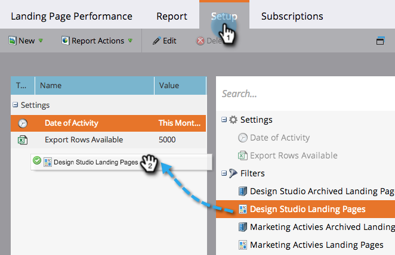
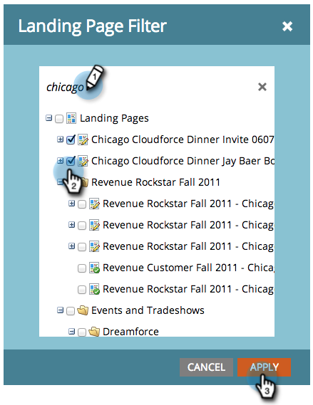

# Filter a Landing Page Performance Report {#filter-a-landing-page-performance-report}

Focus your [landing page performance report](../../../../product-docs/demand-generation/landing-pages/understanding-landing-pages/landing-page-performance-report.md) on landing pages in your programs (local assets), on those in Design Studio (global assets), or on those that have been archived.

1. Go to **Analytics** (or **Marketing Activities**).

   

1. Select your landing page report from the navigation tree.

   

1. Click the **Setup** tab and drag in a filter.

   

    * **Design Studio Landing Pages:** Global assets, managed in the Design Studio.
    * **Marketing Activities Landing Pages:** Local assets in programs on the Marketing Activities tab.
    * **Archived Landing Pages:** Inactive, retired landing pages.

1. Choose the folders and specific landing pages to include in your report.

   

   >[!TIP]
   >
   >If you select a folder, your report will include everything that folder contains at the time the report runs.&nbsp;

1. You're done! Click the **Report** tab to see your filtered report.

   

>[!NOTE]
>
>**Deep Dive**
>
>Learn all about reports in [basic reporting](http://docs.marketo.com/display/docs/basic+reporting).

