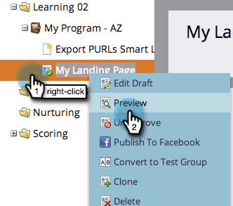
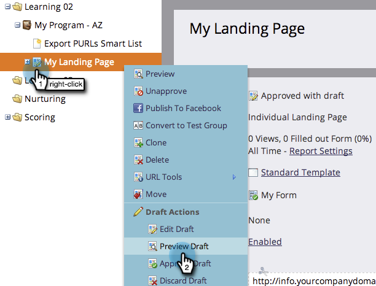
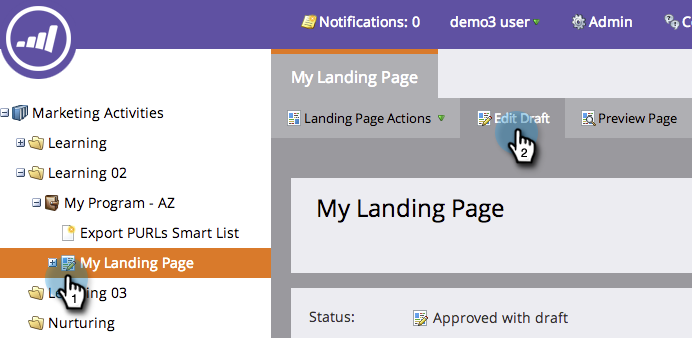
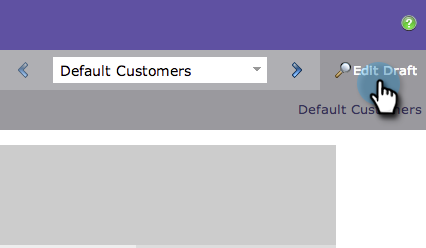

# Preview a Landing Page {#preview-a-landing-page}

You probably want to see what your landing page looks like before making it live.

## Preview a Landing Page {#preview-a-landing-page-1}

1. Select a landing page and click **Preview** **Page**.

   

   >[!NOTE]
   >
   >The draft is the version you are working on, not the live one customers see.

1. You can also right-click your landing page and select **Preview**.

   

## Preview a Landing Page Draft {#preview-a-landing-page-draft}

1. Right click an approved landing page that has a draft version and click on **Preview** **Draft**. 

   

## Preview a Landing Page Draft While Editing {#preview-a-landing-page-draft-while-editing}

1. Select a landing page and click **Edit** **Draft**. 

   

1. At any point during your work in the landing page editor, you can click **Preview Draft.**

   

1. You can quickly return to editing by clicking **Edit Draft.**

   

Nice work! Now you know how to preview landing pages.
