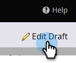

# Preview a Landing Page {#preview-a-landing-page}

Preview your landing page to see how it looks before making it live.

>[!IMPORTANT]
>
>Some custom meta tags are not supported in preview mode (such as the `<meta http-equiv="refresh" ...>` redirect directive), as they can violate the Content Security Policy put in place to keep Marketo Engage secure. Landing pages with these tags can be previewed by generating the preview URL (**Preview actions** > **Generate Preview URL**) and pasting it into a new browser window.

## Preview an approved page {#preview-approved-page}

1. Select the desired landing page and click **[!UICONTROL Preview]**.

   

You can also right-click your landing page and select **[!UICONTROL Preview]**.

## Preview a draft {#preview-a-draft}

1. Select the desired landing page and click **[!UICONTROL Preview draft]**.

   

>[!NOTE]
>
>The draft is the version you are working on, not the live one customers see.

## Preview a landing page draft while editing {#preview-a-draft-while-editing}

1. Select the desired landing page and click **[!UICONTROL Edit draft]**.

   

1. In the landing page editor, click **[!UICONTROL Preview draft]**.

   

1. Return to editing by clicking **[!UICONTROL Edit draft]**.

   
