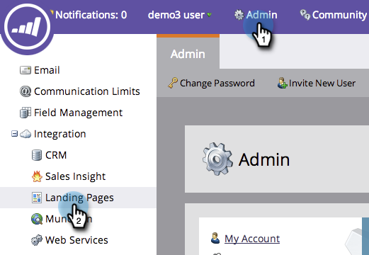
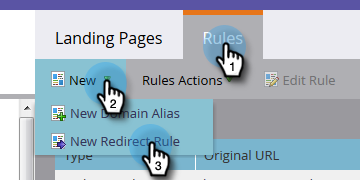
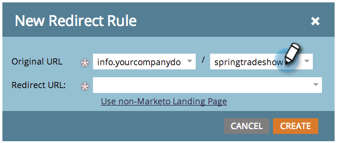
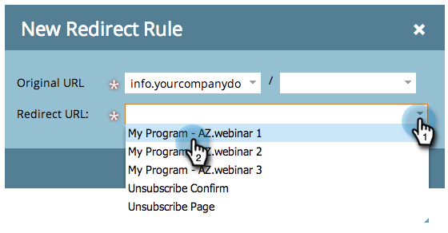
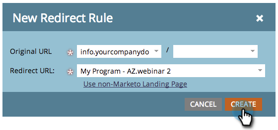

# Redirect a Marketo Landing Page to Another Page {#redirect-a-marketo-landing-page-to-another-page}

If you ever update a page's URL and want the old URL to still work, try a redirect! Setting it up is easy.

>[!NOTE]
>
>**Admin Permissions Required**

1. Under **Admin**, click **Landing Pages**.

   

1. Under the **Rules** tab, click **New** and then **New Redirect Rule**.

   

1. Click the first **Original URL** drop-down and select your Marketo [CNAME](/help/marketo/product-docs/demand-generation/landing-pages/landing-page-actions/customize-your-landing-page-urls-with-a-cname.md).

   

   >[!NOTE]
   >
   >Remember, you can only redirect URLs that start with your Marketo [CNAME](/help/marketo/product-docs/demand-generation/landing-pages/landing-page-actions/customize-your-landing-page-urls-with-a-cname.md).

1. Choose the landing page you want to redirect in the second **Original URL** field.

   

   >[!NOTE]
   >
   >You can enter any URL path, even if the page or directory doesn't exist.

1. Click the **Redirect URL** drop-down and select the page you want to redirect visitors to.

   

1. Click **Create**.

   

   >[!TIP]
   >
   >To redirect to a web page outside of Marketo, click **Use non-Marketo Landing Page**.

   >[!MORELIKETHIS]
   >
   >[Redirect a URL Path](/help/marketo/product-docs/demand-generation/landing-pages/personalizing-landing-pages/redirect-a-url-path.md)
