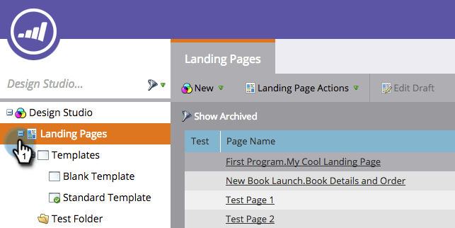

# Edit a Marketo Landing Page Template {#edit-a-marketo-landing-page-template}

You can edit any landing page template within Marketo.

1. Go to **[!UICONTROL Design Studio]**.

   

1. Expand **[!UICONTROL Landing Pages]** in order to show the templates.

   

1. Select the **[!UICONTROL Template]** you wish to edit. Click **[!UICONTROL Edit Draft]**.

   

   Done! Now you can edit the CSS of the template and have full control over its appearance and layout.

   >[!NOTE]
   >
   >When you edit a landing page template, it will create a draft of any landing page asset using that template.
