# Guided Landing Page Template List {#guided-landing-page-template-list}

Browse our collection of example templates, for use with the [Guided Landing Page Editor](/help/marketo/product-docs/demand-generation/landing-pages/guided-landing-pages/create-a-guided-landing-page.md). Each template is fully responsive and based off of the Bootstrap framework.

>[!NOTE]
>
>Marketo Support is not set up to assist with troubleshooting HTML. If you need assistance modifying any of these templates, please consult a web developer.

To import a template into Marketo:

1. Click on the name of the template for larger view.
1. Download the template chosen.
1. In Marketo, navigate to the **[!UICONTROL Design Studio].**
1. Click **[!UICONTROL Landing Pages]** in the left-hand tree, then select **[!UICONTROL Templates.**

1. In the menu bar, click **[!UICONTROL Import Template].**
1. Choose the downloaded file, enter a template name, then click **[!UICONTROL Import** (make sure to pick a descriptive name and indicate that editing mode is **[!UICONTROL Guided]**).

|   |  |  |
|---|---|---|
| [Template 1A](guided-landing-page-templates/template-1a.md) | [Template 1B](guided-landing-page-templates/template-1b.md) | [Template 1C](guided-landing-page-templates/template-1c.md) |
| | | |
| [Template 1D](guided-landing-page-templates/template-1d.md) | [Template 1E](guided-landing-page-templates/template-1e.md) | [Template 1F](guided-landing-page-templates/template-1f.md) |
| | | |
| [Template 2A](guided-landing-page-templates/template-2a.md) | [Template 2B](guided-landing-page-templates/template-2b.md) | [Template 2C](guided-landing-page-templates/template-2c.md) |
| 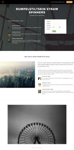| 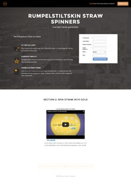| |
| [Template 2D](guided-landing-page-templates/template-2d.md) | [Template 3A](guided-landing-page-templates/template-3a.md) | [Template 3B](guided-landing-page-templates/template-3b.md) |
| 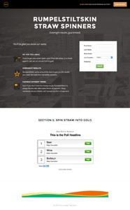| | |
| [Template 3C](guided-landing-page-templates/template-3c.md) | [Template 3D](guided-landing-page-templates/template-3d.md) | [Template 4A](guided-landing-page-templates/template-4a.md) |
| | | 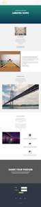|
| [Template 4B](guided-landing-page-templates/template-4b.md) | [Template 4C](guided-landing-page-templates/template-4c.md) | [Template 5A](guided-landing-page-templates/template-5a.md) |
| | | |
| [Template 5B](guided-landing-page-templates/template-5b.md) | [Template 5C](guided-landing-page-templates/template-5c.md) | [Template 5D](guided-landing-page-templates/template-5d.md) |
| | | |
| [Template 5E](guided-landing-page-templates/template-5e.md) | [Template 6A](guided-landing-page-templates/template-6a.md) | [Template 6B](guided-landing-page-templates/template-6b.md) |
| | | |
| [Template 6C](guided-landing-page-templates/template-6c.md) | [Template 6D](guided-landing-page-templates/template-6d.md) | [Template 6E](guided-landing-page-templates/template-6e.md) |
| 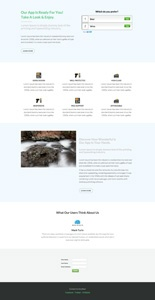| | |
| [Template 7A](guided-landing-page-templates/template-7a.md) | [Template 7B](guided-landing-page-templates/template-7b.md) | [Template 7C](guided-landing-page-templates/template-7c.md) |
| 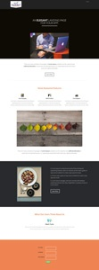| | |
| [Template 7D](guided-landing-page-templates/template-7d.md) | [Template 7E](guided-landing-page-templates/template-7e.md) | [Template 7F](guided-landing-page-templates/template-7f.md) |
| | | |
| [Template 8A](guided-landing-page-templates/template-8a.md) | [Template 8B](guided-landing-page-templates/template-8b.md) | [Template 8C](guided-landing-page-templates/template-8c.md) |
| | | 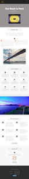|
| [Template 8D](guided-landing-page-templates/template-8d.md) | [Template 8E](guided-landing-page-templates/template-8e.md) | [Template 8F](guided-landing-page-templates/template-8f.md) |
| | | |
| [Template 8G](guided-landing-page-templates/template-8g.md) | [Template 9A](guided-landing-page-templates/template-9a.md) | [Template 9B](guided-landing-page-templates/template-9b.md) |
| 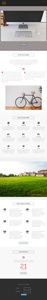| 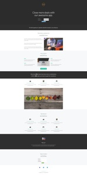| |
| [Template 9C](guided-landing-page-templates/template-9c.md) | [Template 9D](guided-landing-page-templates/template-9d.md) | [Template 9E](guided-landing-page-templates/template-9e.md) |
| | | |
| [Template 9F](guided-landing-page-templates/template-9f.md) | [Template 10A](guided-landing-page-templates/template-10a.md) | [Template 10B](guided-landing-page-templates/template-10b.md) |
| | | |
| [Template 10C](guided-landing-page-templates/template-10c.md) | [Template 10D](guided-landing-page-templates/template-10d.md) | [Template 10E](guided-landing-page-templates/template-10e.md) |
| | | |
| [Template 10F](guided-landing-page-templates/template-10f.md) | [Template 11A](guided-landing-page-templates/template-11a.md) | [Template 11B](guided-landing-page-templates/template-11b.md) |
| | | |
| [Template 11C](guided-landing-page-templates/template-11c.md) | [Template 11D](guided-landing-page-templates/template-11d.md) | [Template 11E](guided-landing-page-templates/template-11e.md) |
| 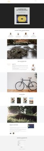| | |
| [Template 11F](guided-landing-page-templates/template-11f.md) | [Template 12A](guided-landing-page-templates/template-12a.md) | [Template 12B](guided-landing-page-templates/template-12b.md) |
| | | |
| [Template 12C](guided-landing-page-templates/template-12c.md) | [Template 12D](guided-landing-page-templates/template-12d.md) | [Template 12E](guided-landing-page-templates/template-12e.md) |
| | | 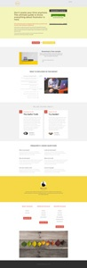|
| [Template 12F](guided-landing-page-templates/template-12f.md) | [Template 13A](guided-landing-page-templates/template-13a.md) | [Template 13B](guided-landing-page-templates/template-13b.md) |
| | | |
| [Template 13C](guided-landing-page-templates/template-13c.md) | [Template 13D](guided-landing-page-templates/template-13d.md) | [Template 13E](guided-landing-page-templates/template-13e.md) |
| | | |
| [Template 14A](guided-landing-page-templates/template-14a.md) | [Template 14B](guided-landing-page-templates/template-14b.md) | [Template 14C](guided-landing-page-templates/template-14c.md) |
| | | |
| [Template 14D](guided-landing-page-templates/template-14d.md) | [Template 14E](guided-landing-page-templates/template-14e.md) | [Template 15A](guided-landing-page-templates/template-15a.md) |
| | | |
| [Template 15B](guided-landing-page-templates/template-15b.md) | [Template 15C](guided-landing-page-templates/template-15c.md) | [Template 15D](guided-landing-page-templates/template-15d.md) |
| | 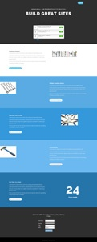| |
| [Template 15E](guided-landing-page-templates/template-15e.md) | [Template 16A](guided-landing-page-templates/template-16a.md) | [Template 16B](guided-landing-page-templates/template-16b.md) |
| | | |
| [Template 16C](guided-landing-page-templates/template-16c.md) | [Template 16D](guided-landing-page-templates/template-16d.md) | [Template 16E](guided-landing-page-templates/template-16e.md) |
| 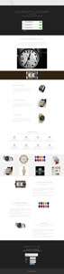| | |
| [Template 17A](guided-landing-page-templates/template-17a.md) | [Template 17B](guided-landing-page-templates/template-17b.md) | [Template 17C](guided-landing-page-templates/template-17c.md) |
| | | |
| [Template 17D](guided-landing-page-templates/template-17d.md) | [Template 17E](guided-landing-page-templates/template-17e.md) | [Template 18A](guided-landing-page-templates/template-18a.md) |
| | | |
| [Template 18B](guided-landing-page-templates/template-18b.md) | [Template 18C](guided-landing-page-templates/template-18c.md) | [Template 18D](guided-landing-page-templates/template-18d.md) |
| | | |
| [Template 18E](guided-landing-page-templates/template-18e.md) | [Template 19A](guided-landing-page-templates/template-19a.md) | [Template 19B](guided-landing-page-templates/template-19b.md) |
| | | |
| [Template 19C](guided-landing-page-templates/template-19c.md) | [Template 19D](guided-landing-page-templates/template-19d.md) | [Template 19E](guided-landing-page-templates/template-19e.md) |
| | | |
| [Template 20A](guided-landing-page-templates/template-20a.md) | [Template 20B](guided-landing-page-templates/template-20b.md) | [Template 20C](guided-landing-page-templates/template-20c.md) |
| | | |
| [Template 20D](guided-landing-page-templates/template-20d.md) | [Template 20E](guided-landing-page-templates/template-20e.md) |  |
| | |  |
