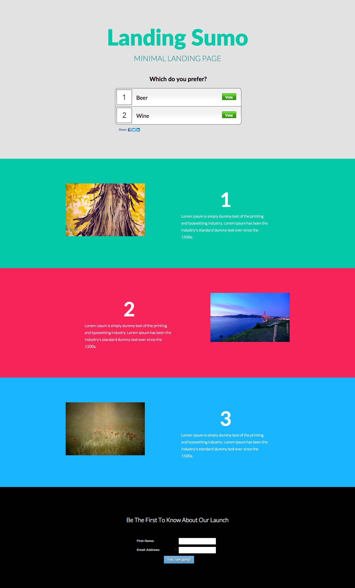

# Template 10D {#template-10d}

Right-click to [download Template 10D](https://experienceleague.adobe.com/landing/marketo/lp-templates/template-10d.html)

This template includes the following content:

* A primary section

  * includes a hero header, hero text and a hero poll

* Three body sections (optional)
* A footer (optional)

**Right-click below to download this template:**

[Template 10D.html](https://experienceleague.adobe.com/landing/marketo/lp-templates/template-10d.html)
