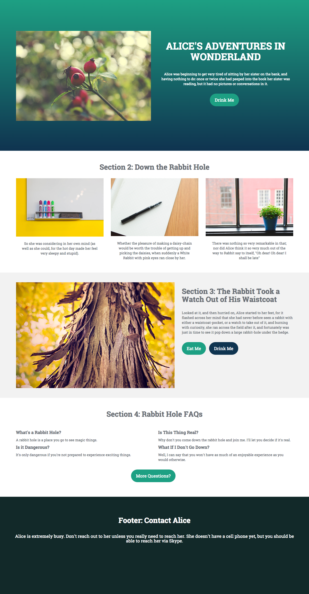

# Template 1A {#template-1a}

Right-click to [download Template 1A](https://experienceleague.adobe.com/landing/marketo/lp-templates/template-1a.html)

This template includes the following content:

* A primary section

  * includes hero image, header, body text, and button.

* Three body sections (optional)
* Footer (optional)

**Right-click below to download this template:**

[Template 1A.html](https://experienceleague.adobe.com/landing/marketo/lp-templates/template-1a.html)
