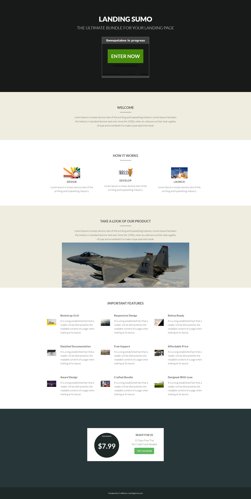

# Template 20D {#template-20d}

Right-click [download Template 20D](https://51837-micrositemarketo.adobeio-static.net/lp-templates/template-20d.html) and select **Save link as...**

>[!NOTE]
>
>Complete steps on how to download and import a template [can be found here](/help/marketo/product-docs/demand-generation/landing-pages/landing-page-templates/guided-landing-page-template-list.md#how-to-import){target="_blank"}.

This template includes the following content:

* A primary section

  * includes hero sweepstakes and text

* Four body sections (optional)
* Footer (optional)

**Right-click below (and select _Save link as..._) to download this template:**

[Template 20D.html](https://51837-micrositemarketo.adobeio-static.net/lp-templates/template-20d.html)
