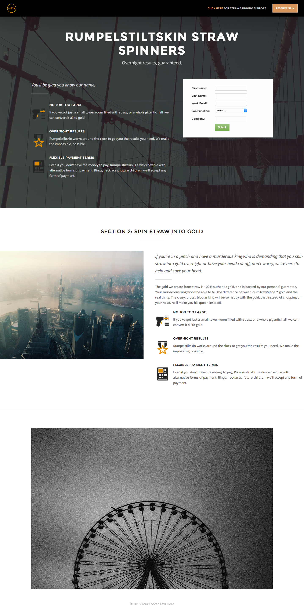

# Template 2A {#template-2a}

Right-click to [download Template 2A](https://experienceleague.adobe.com/landing/marketo/lp-templates/template-2a.html)

This template includes the following content:

* A header with logo and button (optional)
* A primary section

  * includes hero background image, header, tagline, bulleted list, and form.

* One body section (optional)
* Footer (optional)

**Right-click below to download this template:**

[Template 2A.html](https://experienceleague.adobe.com/landing/marketo/lp-templates/template-2a.html)
