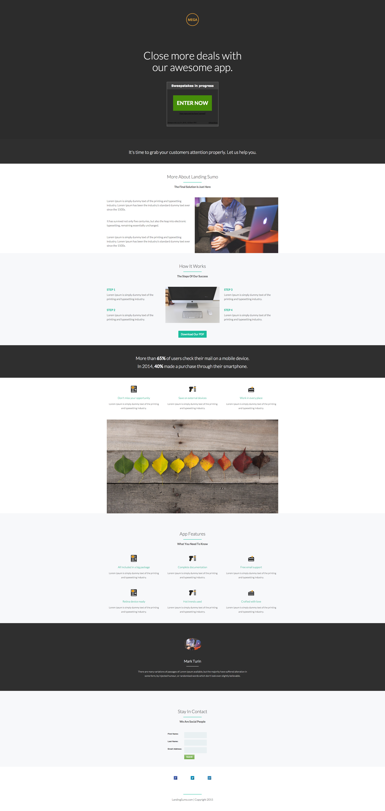

# Template 9F {#template-9f}

Right-click [download Template 9F](https://51837-micrositemarketo.adobeio-static.net/lp-templates/template-9f.html) and select **Save link as...**

>[!NOTE]
>
>Complete steps on how to download and import a template [can be found here](/help/marketo/product-docs/demand-generation/landing-pages/landing-page-templates/guided-landing-page-template-list.md#how-to-import){target="_blank"}.

This template includes the following content:

* A primary section

  * includes a logo image, a hero header and a sweepstake

* Eight body sections (optional)
* A footer (optional)

**Right-click below (and select _Save link as..._) to download this template:**

[Template 9F.html](https://51837-micrositemarketo.adobeio-static.net/lp-templates/template-9f.html)
