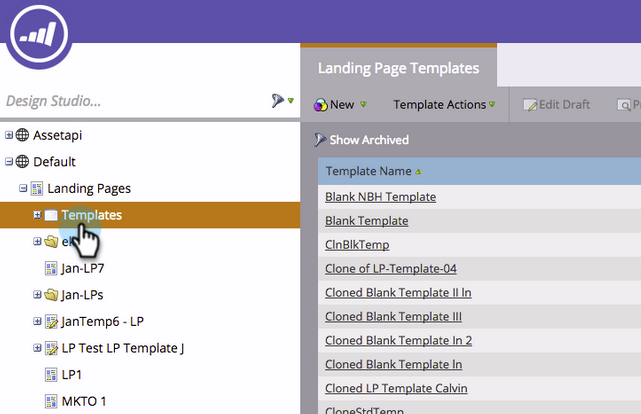
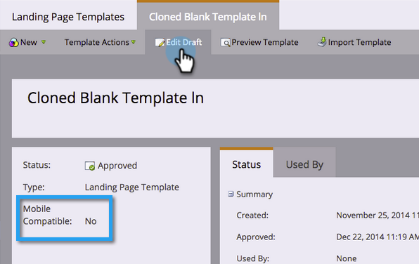
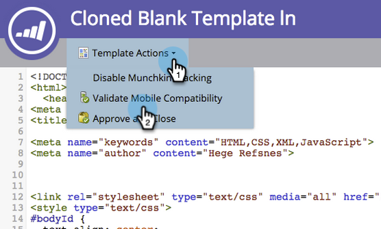
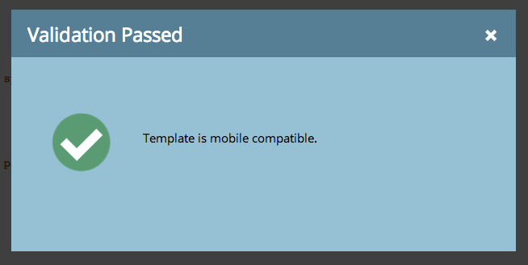
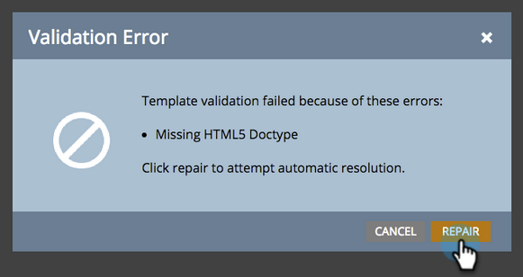
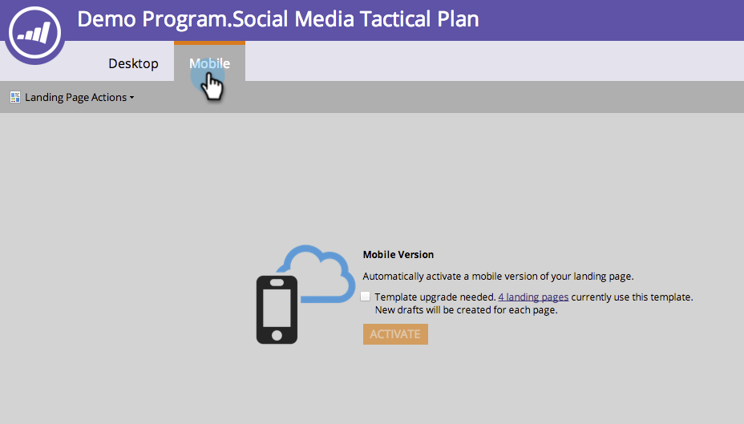

# Make an Existing Free-form Landing Page Template Mobile Compatible {#make-an-existing-free-form-landing-page-template-mobile-compatible}

>[!NOTE]
>
>Landing pages templates that were created before the [January 2015 release](../../../../release-notes/2015/release-notes-january-2015.md)need to be upgraded to be mobile compatible.

This can be done in two places, the Template Editor and the Landing Page Editor.  

## Upgrade from the Template Editor {#upgrade-from-the-template-editor}

1. Go to the **Design Studio**.

   

1. Select **Templates**.

   

1. Select a template where **Mobile Compatible** is **No**.

   

1. Click **Edit Draft**.

   

1. Click **Make Mobile Compatible**.

   

1. Click **Upgrade**.

   

   Your landing page template is now mobile compatible!

   >[!NOTE]
   >
   >Upgrading should be harmless, but make sure to check pages for any discrepancies. Upgrading will create drafts of any landing pages using that template.

   

   ## What Makes a Template Mobile Compatible? {#what-makes-a-template-mobile-compatible}

   Great questions! Your template must have have the following tags:

   `<pre data-theme="Confluence">Must have <!DOCTYPE HTML> Must have a <HEAD> element Must have a <TITLE> in the <HEAD> element Must have <META CHARSET="UTF-8"> within the <HEAD> element Must have a <BODY> element that contains one (and only one) 

</pre>`  If everything looks good, you'll see this message.

   

   If something is wrong, an error message will display, click repair to fix the issue and repeat the validation process.

   

If you make any changes to the template, Click Template Actions and select Validate Mobile Compatibility. 

## Upgrading a Template from the Free-form Landing Page Editor {#upgrading-a-template-from-the-free-form-landing-page-editor}

When you're editing a landing page and you click on the mobile tab, you'll sometimes notice the template has not been upgraded. Fear not! You can upgrade it right there.

1. Click the **Mobile** tab.

   

1. Click the check box and click **Activate**.

   

   >[!NOTE]
   >
   >Activating the mobile version of a template will create drafts of any landing pages that use it.

Awesome! You can now [customize the mobile view](../../../../product-docs/demand-generation/landing-pages/free-form-landing-pages/customize-mobile-view-for-your-free-form-landing-page.md) of all your landing pages that use this template.

>[!NOTE]
>
>**Related Articles**
>
>* [Customize Mobile View for Your Free-Form Landing Page](../../../../product-docs/demand-generation/landing-pages/free-form-landing-pages/customize-mobile-view-for-your-free-form-landing-page.md)
>

