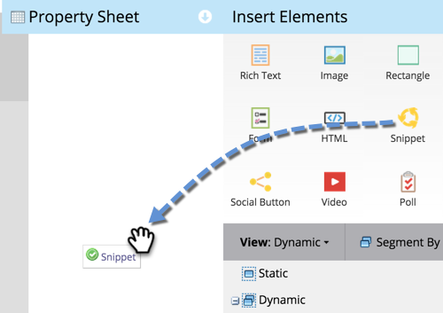

# Add a Snippet to a Landing Page {#add-a-snippet-to-a-landing-page}

Snippets are little bits of HTML that can follow rules and hold personalized content.

>[!PREREQUISITES]
>
>[Create a Snippet](/help/marketo/product-docs/personalization/segmentation-and-snippets/snippets/create-a-snippet.md)

1. Select your landing page and click **Edit Draft**.

   

1. In the landing page editor, drag over the **Snippet** element.

   

1. Find your snippet, select it, and click **Save**.

   

   >[!TIP]
   >
   >If you cannot find your snippet, make sure it's approved first.

   >[!NOTE]
   >
   >If you're looking to add a snippet to a Guided Landing Page, see [this article](/help/marketo/product-docs/demand-generation/landing-pages/landing-page-templates/create-a-guided-landing-page-template.md).

Awesome job! Now you know how to add snippets to your landing pages.
