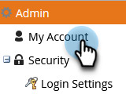
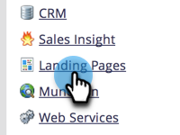
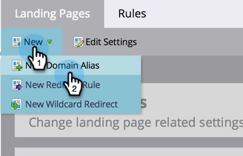
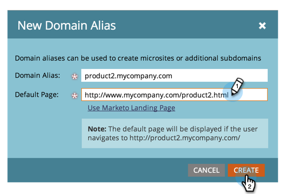

# Add Additional Landing Page CNAMEs {#add-additional-landing-page-cnames}

You may want to add landing page CNAMEs to allow different URLs to point to your Marketo landing pages. Following the steps below will help you manage multiple domains.

>[!CAUTION]
>
>Cookies are not shareable across domains.

>[!TIP]
>
>**Same top level domain - Good! Cookies are shared**.  **go**.mycompany.com > **info**.mycompany.com
>
>**Different top level domains - Bad! Cookies are _not_ shared**.  go.**mycompany**.com > go.**mynewcompany**.com

>[!NOTE]
>
>**Admin Permissions Required**

1. Go to the **Admin** area.

   

1. Click **My Account**.

   

1. Scroll down to "Support Information" and copy your Munchkin ID.

   

## Send Request to IT {#send-request-to-it}

1. Ask your IT department to setup the following CNAME: (Replace the word [CNAME] with the CNAME of your choice and [Munchkin ID] with the text from the previous step).

   [CNAME].YourCompany.com > [Munchkin ID].mktoweb.com

## Add a New CNAME {#add-a-new-cname}

1. Once your IT department has created the CNAME, go to the **Admin** area.

   

1. Click **Landing Pages**.

   

1. Click **New** then select **New Domain Alias**.

   

1. Enter your **Domain Alias.** The **Default Page** is displayed if the visitor does not put in a URL. Enter where they should go in that case.

   >[!NOTE]
   >
   >For the Default Page, you can select a landing page or an external URL, such as your public website.

   

1. Enter your **Default Page** and click **Create**.

   

Nice! Now you know what to do if you ever want to add a CNAME.
