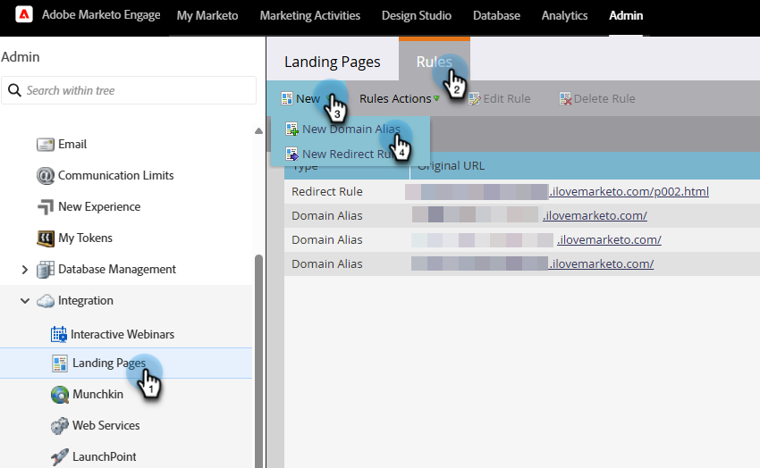
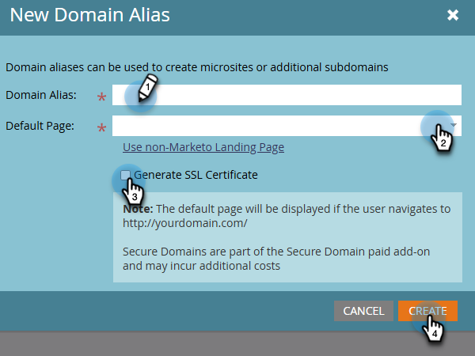
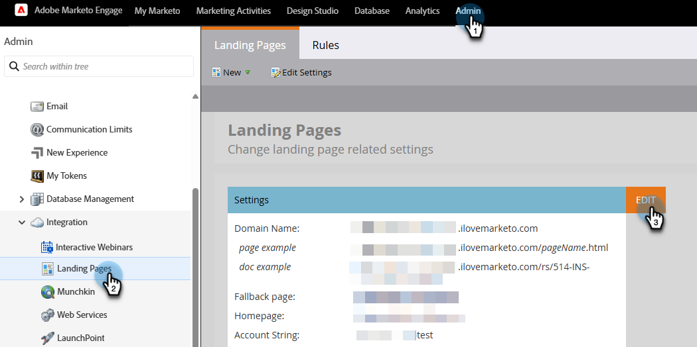
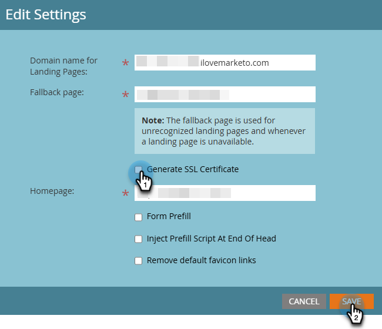
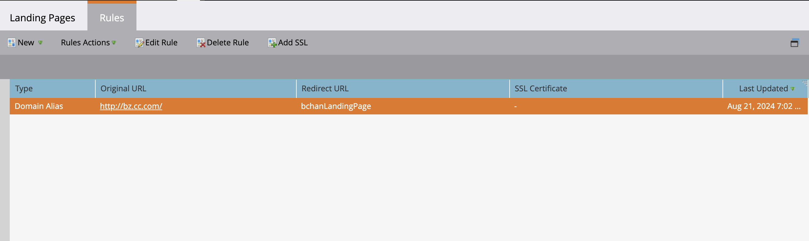
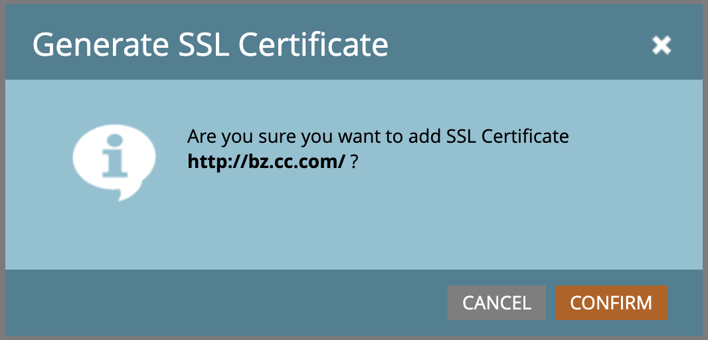

# Add SSL to Your Landing Pages {#add-ssl-to-your-landing-pages}

SSL (Secure Socket Layer) encryption lets you make all of your Landing Pages for a Marketo Engage instance secure.

When you fill out a web form or visit a Landing Page that's hosted by Marketo Engage, by default, the information is sent over non-secure protocol (HTTP). Per your company's policy, you may want to secure the information submitted to Marketo over (HTTPS). For example, when you visit `http://info.mydomain.com/` it will now be `https://info.mydomain.com/`.

Marketo Engage tracks "Visited Web Page" and "Click Link on Web Page" by default over non-secure HTTP protocol. If you want to have your tracking links secured with their own certificate, you need to have Marketo build a separate non-shared server to enable it. To secure all aspects of a contact's interaction with you typically means securing both Landing Pages and tracking links.

>[!IMPORTANT]
>
>Before adding an SSL, be sure to check your contract for the total number of domains you're permitted to add. Otherwise, you may incur a fee. If you cannot find the information, please reach out to the Adobe Account Team (your account manager) for details.

## Enable SSL certification {#enable-ssl-certification}

Automatically add SSL for all the domain aliases you create as part of the Landing Page rules.

1. Go to the **Admin** area.

   

1. Select **Landing Pages** from the tree. In the **Rules** tab, click the **New** drop-down and select **New Domain Alias**.

   

1. Enter your _Domain Alias_ and _Default Page_. Select the **Generate SSL Certificate** checkbox. Click **Create** when done.

   

This automatically adds an SSL certificate for this domain.

## Enable SSL for your default domain {#enable-ssl-default-domain}

Follow the steps below to enable SSL for your default domain.

1. Still in the **Admin** section, select **Landing Pages**. Click the orange **Edit** button next to _Settings_.

   {width="800" zoomable="yes"}

   >[!NOTE]
   >
   >If desired, you can also modify the domain name here (valid domain required).

1. Select the "Generate SSL Certificate" checkbox and click Save.

   

>[!NOTE]
>
>It can take up to three minutes for the SSL to be in the READY state. Refresh the page for the changes to appear.

## Edit SSLs to existing domains aliases

Follow these steps to enable SSL for your existing domain aliases.

1. From the _[!UICONTROL Admin]_ area, expand **[!UICONTROL Integration]** in the left navigation and select **[!UICONTROL Landing Pages]**.

1. On the page, select the **[!UICONTROL Rules]** tab at the top.

1. Select the domain alias row that you want to edit and click **[!UICONTROL Add SSL]** on the top.

   {width="800" zoomable="yes"}

1. In the dialog, click **[!UICONTROL Confirm]**.

   {width="400"}

>[!NOTE]
>
>It can take up to three minutes for the SSL to be in the READY state. Refresh the page for the changes to appear.

## Error Messages {#error-messages}

Below you'll find error messages you may receive along with their definitions.

<table><thead>
  <tr>
    <th>Error</th>
    <th>Details</th>
  </tr></thead>
<tbody>
<tr>
    <td><i>Domain already exists.</i></td>
    <td>A domain with same name already exists.</td>
  </tr>
  <tr>
    <td><i>Domain is not mapped to the default domain.</i></td>
    <td>The custom domain is not correctly mapped to the default domain. Please verify the domain mapping settings and ensure the DNS configuration points to the correct default domain.</td>
  </tr>
  <tr>
    <td><i>SSL certificates could not be issued due to unsupported CAA records. Request your IT to update your CAA records.</i></td>
    <td>The CAA records are not up to date. For those using Marketo Engage managed SSL certificates, CAA records need to be updated to certificates recommended by our vendor. Please contact your IT department to update the CAA records. See <a href="https://nation.marketo.com/t5/product-blogs/changes-to-marketo-engage-secured-domains-platform/ba-p/329305#M2246">this page</a> for additional details.</td>
  </tr>
  <tr>
    <td><i>SSL certificate has already been issued.</i></td>
    <td>An SSL certificate already exists for this custom domain. No further action is needed unless the certificate has expired or needs to be reissued.</td>
  </tr>
  <tr>
    <td><i>The default domain was not found. Please contact Support for assistance.</i></td>
    <td>There was an issue when trying to locate the default domain. Please reach out to Support so they can investigate.</td>
  </tr>
  <tr>
    <td><i>Unexpected error encountered while creating a domain. Please contact Support for assistance.</i></td>
    <td>An unexpected error has occurred. Please gather logs and error details, and escalate the issue to <a href="https://nation.marketo.com/t5/support/ct-p/Support" target="_blank">Marketo Support</a>.</td>
  </tr>
</tbody></table>

## Things to Note {#things-to-note}

* **DNS mapping for domain to Marketo Engage**: Before adding adding domains in the UI, you must [map CNAMEs to a Marketo-provided domain](https://experienceleague.adobe.com/en/docs/marketo/using/getting-started/initial-setup/setup-steps#customize-your-landing-page-urls-with-a-cname){target="_blank"}.

* **Custom SSLs**: If you need a custom SSL, please submit a [Support ticket](https://nation.marketo.com/t5/support/ct-p/Support){target="_blank"}. Do not use the self-service checkbox for SSL creation.

* **Pre-existing SSLs**: While adding a domain, the system checks for pre-existing SSLs, which may have been manually created prior. If you encounter this validation, create your domain without selecting SSL creation, and we will connect them for you. [Contact Support](https://nation.marketo.com/t5/support/ct-p/Support){target="_blank"} more additional details/options.

* **Deletion of domains**: Automatically deleting a domain **does not** delete the SSL certificate. This guardrail prevents user errors that result in a website being without SSL certificates. If you do want to remove the SSL certificates, [contact Support](https://nation.marketo.com/t5/support/ct-p/Support){target="_blank"}.
