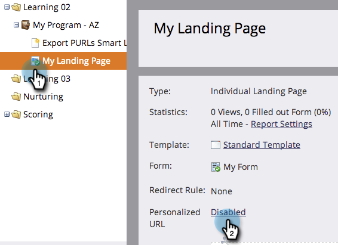
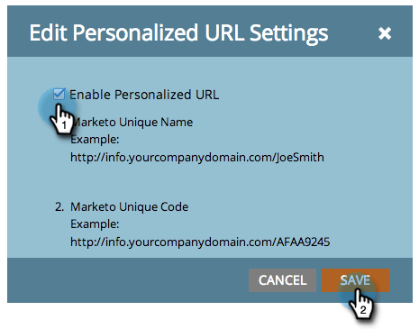

# Enable Personalized URLs for a Landing Page {#enable-personalized-urls-for-a-landing-page}

Personalized URLs are great for print mail campaigns.

>[!PREREQUISITES]
>
>[Enable Personalized URLs for Your Account](/help/marketo/product-docs/demand-generation/landing-pages/personalizing-landing-pages/enable-personalized-urls-for-your-account.md)

1. Select a landing page and click on settings for **Personalized URL**.

   

1. Now you can check **Enable Personalized URLs** and click **Save**.

   

Great! Now you have enabled Personalized URLs for your landing page. Visitors who use that URL will be recognized and tokens will work properly.
